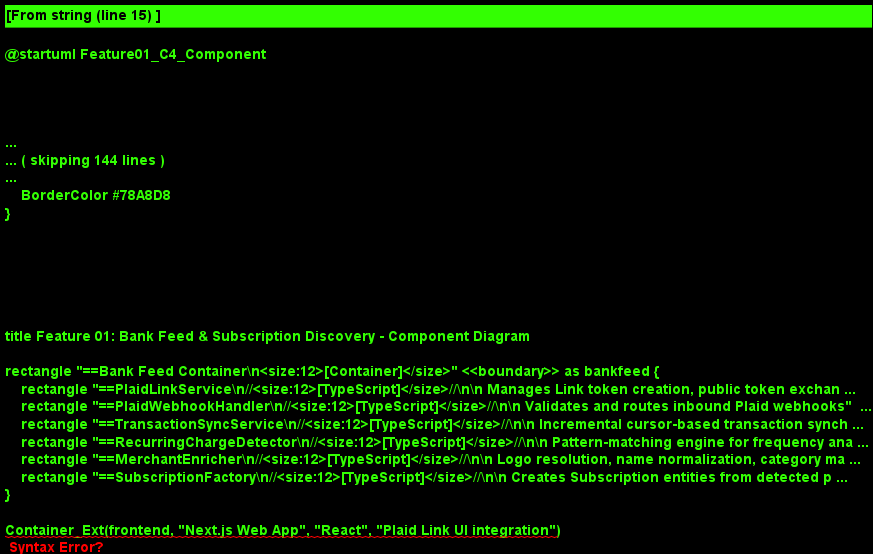
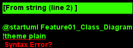
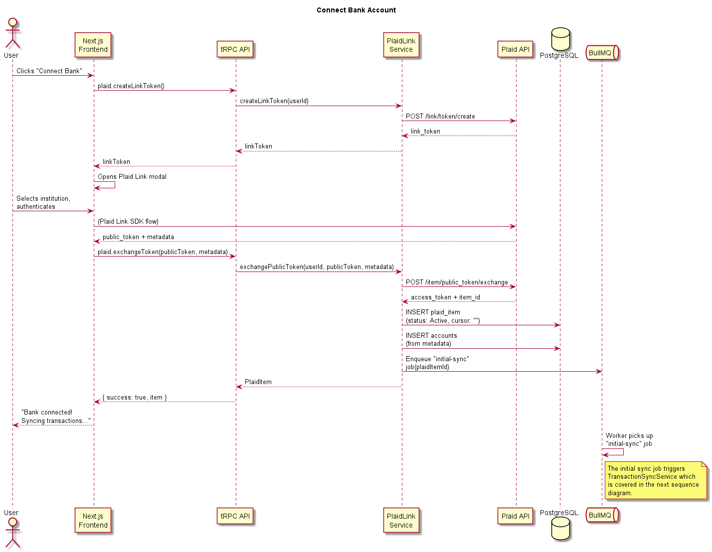
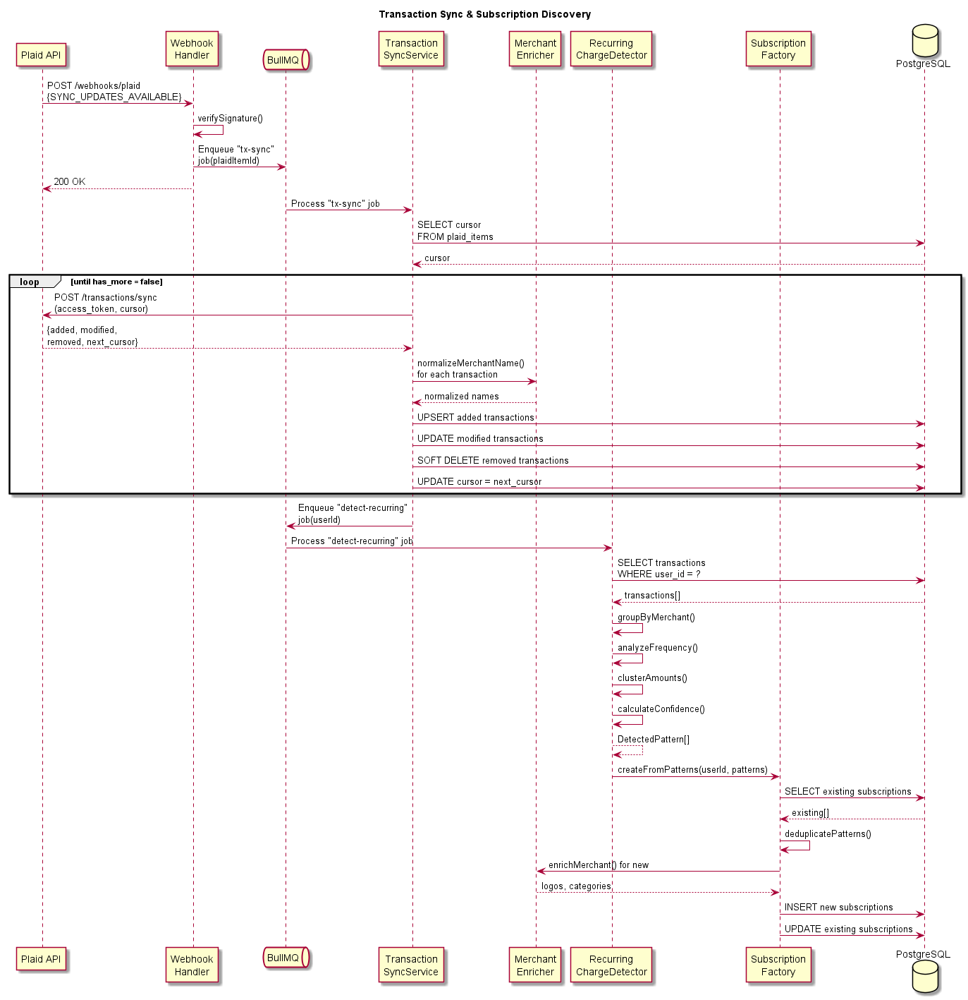
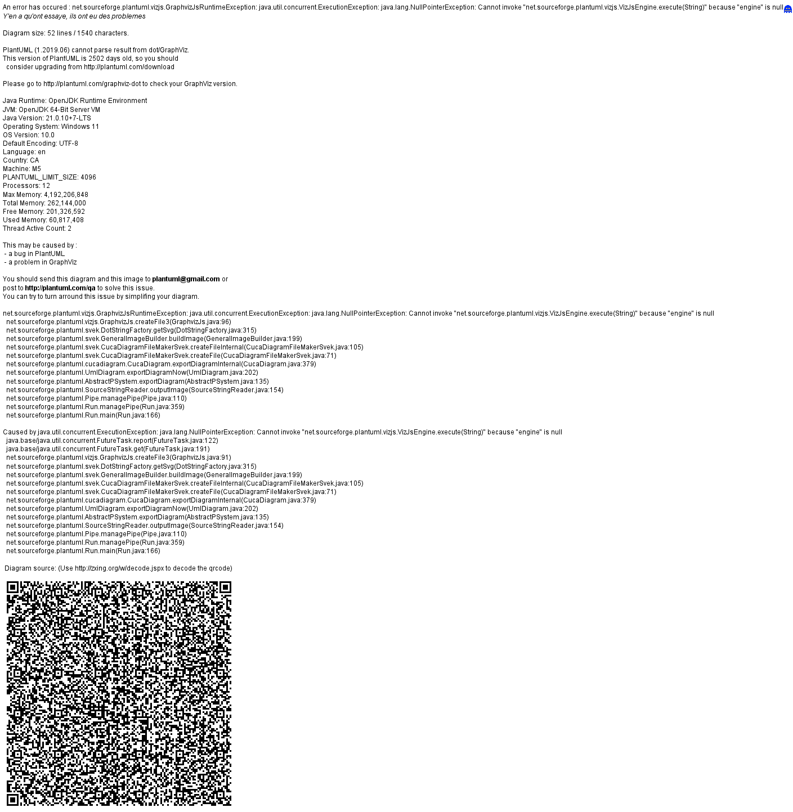

# Feature 01: Bank Feed & Subscription Discovery

## Purpose

Bank Feed & Subscription Discovery is the foundational data ingestion layer of BillKillAgent. It connects to users' financial accounts via Plaid, synchronizes transaction history, and automatically identifies recurring charges that represent subscriptions and bills. Without this feature, no downstream analysis, waste detection, or autonomous action is possible.

## Scope

### In Scope

- Plaid Link integration for secure bank account connection
- Incremental transaction synchronization via Plaid's cursor-based sync API
- Webhook processing for real-time transaction updates and item status changes
- Recurring charge detection through pattern matching on transaction history
- Merchant name normalization and enrichment (logos, categories)
- Subscription entity creation and lifecycle management
- Multi-account support (checking, credit cards, savings)

### Out of Scope

- Manual subscription entry (deferred to a later phase)
- Bill amount prediction / forecasting
- Usage analysis and waste detection (Feature 02)
- Any action-taking on discovered subscriptions (Features 03-05)

## Dependencies

| Dependency | Role | Notes |
|---|---|---|
| **Plaid API** | Financial data provider | Link, Transactions Sync, Item management endpoints |
| **Supabase Auth** | User authentication | JWT validation before Plaid Link initiation |
| **PostgreSQL** | Persistent storage | Tables: `plaid_items`, `accounts`, `transactions`, `subscriptions` |
| **Redis** | Job queue backing | BullMQ queues for async sync and detection jobs |
| **BullMQ** | Job orchestration | Manages sync schedules, retry policies, concurrency |

## Key Architectural Decisions

### 1. Cursor-Based Transaction Sync

**Decision:** Use Plaid's `/transactions/sync` endpoint with cursor-based pagination instead of the legacy `/transactions/get` date-range approach.

**Rationale:**
- Provides incremental updates (only new/modified/removed transactions)
- Eliminates the need to track date windows or handle pagination manually
- Supports real-time webhook-driven sync without redundant data fetching
- Cursor state is persisted per `plaid_item` for reliable resume after failures

### 2. ML-Assisted Pattern Matching for Recurring Charges

**Decision:** Implement a multi-signal pattern matching engine rather than relying solely on Plaid's built-in recurring transaction detection.

**Rationale:**
- Plaid's recurring detection misses edge cases (annual charges, variable-amount bills)
- Custom engine allows tuning for BillKillAgent's specific needs (e.g., aggressive detection with user confirmation)
- Combines frequency analysis, merchant normalization, and amount clustering for higher accuracy
- Confidence scores enable graduated UX (auto-confirm high-confidence, prompt for low-confidence)

### 3. Merchant Normalization Pipeline

**Decision:** Normalize merchant names into canonical identifiers before pattern matching.

**Rationale:**
- Raw Plaid merchant names vary across institutions (e.g., "NETFLIX.COM", "Netflix Inc", "NETFLIX")
- Normalization improves grouping accuracy for recurring charge detection
- Canonical names enable logo resolution and category mapping from a shared enrichment service

### 4. Webhook-First with Scheduled Fallback

**Decision:** Use Plaid webhooks as the primary sync trigger, with a scheduled daily fallback.

**Rationale:**
- Webhooks provide near-real-time updates (typically within minutes of a transaction)
- Scheduled fallback ensures data freshness if webhooks are delayed or missed
- Idempotent sync design (cursor-based) makes redundant syncs safe and cheap

## Data Flow Summary

1. User initiates Plaid Link in the frontend
2. Backend creates a Link token and receives the public token on success
3. Public token is exchanged for an access token; `plaid_item` is persisted
4. Initial transaction sync fetches the full history (up to 2 years)
5. Recurring charge detection runs on the transaction set
6. Discovered subscriptions are created and surfaced to the user
7. Ongoing: webhooks trigger incremental syncs; detection re-runs on new data

## Diagrams

- 
- 
- 
- 
- 
