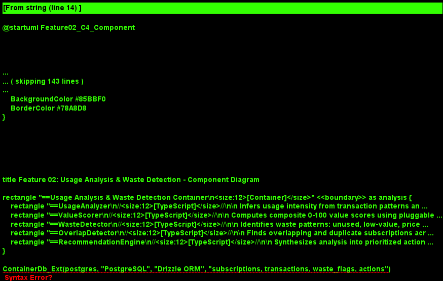
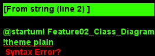
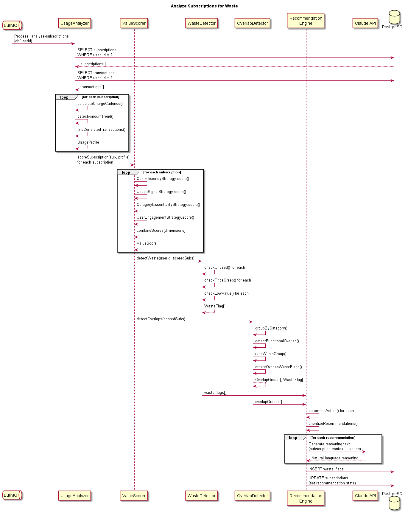
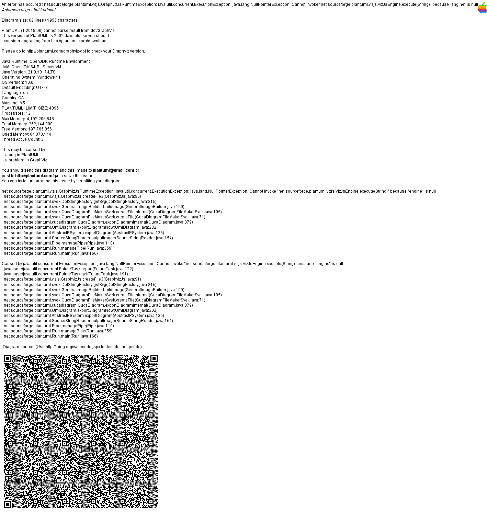

# Feature 02: Usage Analysis & Waste Detection

## Purpose

Usage Analysis & Waste Detection evaluates discovered subscriptions to determine which ones deliver insufficient value relative to their cost. It produces actionable recommendations -- keep, downgrade, cancel, or negotiate -- that drive all downstream autonomous actions. This feature is the analytical brain of BillKillAgent, turning raw subscription data into money-saving insights.

## Scope

### In Scope

- Value scoring algorithm (0-100 scale) combining cost, usage signals, and category benchmarks
- Usage data collection from available signals (transaction frequency, amount trends, time of day)
- Overlap and duplicate detection across subscriptions (e.g., multiple streaming services)
- Waste flag creation with severity levels and estimated savings
- Recommendation engine that maps value scores and waste flags to specific actions
- Subscription recommendation lifecycle management

### Out of Scope

- Direct integration with third-party usage APIs (e.g., screen time APIs) -- future phase
- User self-reported usage tracking
- Price comparison with competing services
- Taking any action on recommendations (Features 03-05)

## Value Scoring Algorithm

Each subscription receives a Value Score from 0 (complete waste) to 100 (essential). The score is computed as a weighted combination of four dimensions:

| Dimension | Weight | Signal Sources |
|---|---|---|
| **Cost Efficiency** | 30% | Amount relative to category median, price trend over time |
| **Usage Signals** | 30% | Transaction frequency patterns, time-of-day consistency, recency |
| **Category Essentiality** | 20% | Category-based base score (utilities=high, entertainment=low) |
| **User Engagement** | 20% | Charge amount stability (not decreasing), multi-account presence |

**Score Interpretation:**
- 80-100: High value -- keep, no action needed
- 60-79: Moderate value -- may benefit from downgrade or negotiation
- 40-59: Low value -- strong candidate for negotiation or cancellation
- 0-39: Waste -- recommend cancellation

## Usage Data Collection

Since BillKillAgent operates from financial transaction data (not direct app usage), usage signals are inferred:

- **Transaction Cadence:** A subscription charged monthly but with additional micro-transactions (in-app purchases) suggests active usage
- **Amount Trend:** Declining amounts over time may indicate downgraded usage
- **Charge Recency:** How recently the last charge appeared relative to the billing cycle
- **Cross-Merchant Activity:** Related transactions (e.g., food delivery charges alongside a delivery subscription) indicate usage

## Overlap & Duplicate Detection

The system identifies subscriptions that serve overlapping purposes:

- **Category Overlap:** Multiple subscriptions in the same category (e.g., 3 streaming services)
- **Functional Overlap:** Services with similar purposes across categories (e.g., Google Drive + Dropbox + iCloud)
- **Tier Overlap:** Same provider at different tiers or through different billing paths

Overlap groups receive a combined analysis showing total spend and the recommended combination to keep.

## Key Architectural Decisions

### 1. Strategy Pattern for Scoring

**Decision:** Each scoring dimension is implemented as a separate strategy, allowing independent testing, tuning, and future extension.

**Rationale:** Scoring criteria will evolve as we gather data on which signals best predict user action. Strategies can be A/B tested independently.

### 2. Claude API for Reasoning

**Decision:** Use Claude API for nuanced waste reasoning and recommendation text generation, not for core score computation.

**Rationale:** Deterministic scoring ensures consistency and explainability. LLM reasoning adds natural-language explanations and catches edge cases the rule engine misses.

### 3. Batch Analysis with Incremental Updates

**Decision:** Run full analysis on initial connection, then incrementally update scores as new transactions arrive.

**Rationale:** Full analysis establishes a baseline. Incremental updates keep scores current without re-processing the entire transaction history.

## Diagrams

- 
- 
- 
- 
