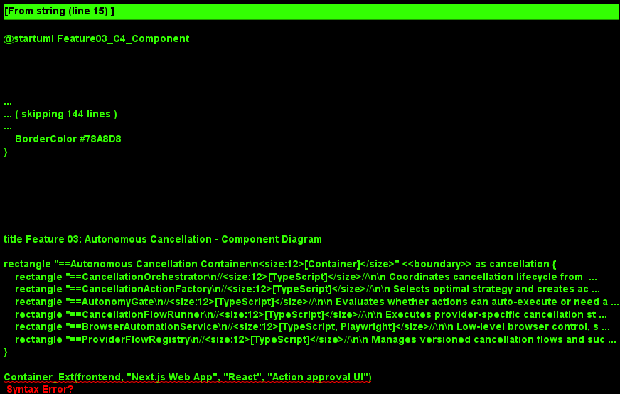
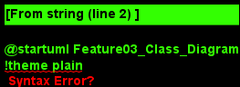
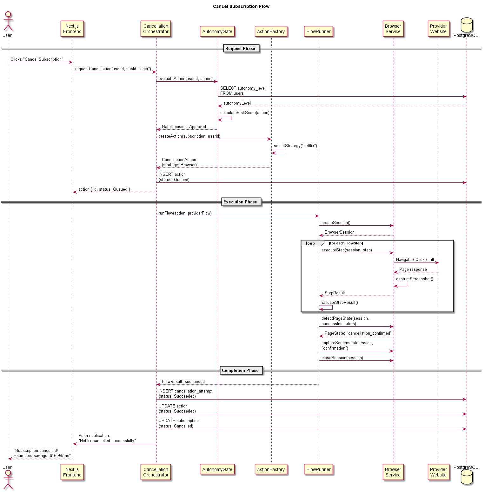
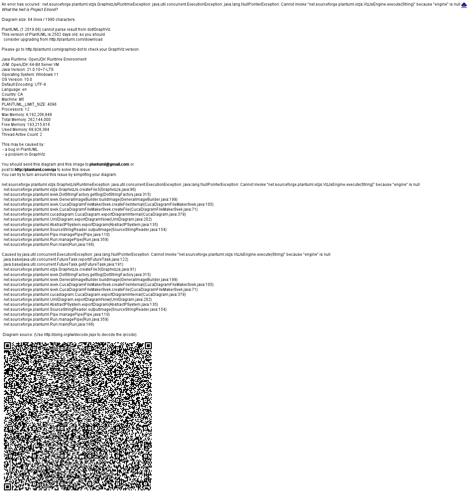

# Feature 03: Autonomous Cancellation

## Purpose

Autonomous Cancellation executes subscription cancellations on behalf of the user. It navigates provider websites, APIs, and communication channels to complete the cancellation process with minimal or no user intervention. This is the first action-taking feature in BillKillAgent, turning waste detection insights into real savings.

## Scope

### In Scope

- Browser-based cancellation via Playwright (primary strategy)
- API-based cancellation for providers with documented cancellation endpoints
- Email-based cancellation with templated cancellation request emails
- Provider flow registry with versioned, crowd-sourced cancellation steps
- Autonomy gating system that respects user preferences for approval levels
- Retry logic with escalation for failed attempts
- Screenshot capture for audit trail and user transparency

### Out of Scope

- Phone-based cancellation (covered by Feature 05: Negotiation Engine)
- Negotiating retention offers during cancellation (Feature 05)
- Billing dispute or chargeback flows
- Provider flow authoring UI (admin-only, future phase)

## Cancellation Strategies

### 1. Browser Automation (Primary)

Uses Playwright to navigate provider websites and complete cancellation flows. This covers the majority of consumer subscriptions (streaming, SaaS, fitness, etc.).

**Approach:**
- Load the provider's cancellation flow steps from the `ProviderFlowRegistry`
- Launch a headless browser session with appropriate anti-detection measures
- Execute each step: navigate, click, fill forms, handle confirmation dialogs
- Capture screenshots at each step for the audit trail
- Detect success/failure indicators on the confirmation page

### 2. API-Based Cancellation

For providers with documented cancellation APIs (e.g., Stripe-billed services, some SaaS platforms).

**Approach:**
- Use stored provider API credentials (OAuth tokens where the user has granted access)
- Make the appropriate API call to cancel or downgrade the subscription
- Verify cancellation status via a follow-up API call

### 3. Email-Based Cancellation

Fallback for providers that accept cancellation via email (common for smaller services and enterprise SaaS).

**Approach:**
- Generate a cancellation request email using a Claude-powered template
- Send via the user's email (with permission) or a platform email
- Monitor for confirmation response
- Flag for manual follow-up if no response within 48 hours

## Autonomy Levels

Users configure their preferred autonomy level, which gates all cancellation actions:

| Level | Behavior |
|---|---|
| **Manual** | All cancellations require explicit user approval before execution |
| **Supervised** | Low-risk cancellations auto-execute; high-value or complex ones require approval |
| **Autonomous** | All cancellations execute automatically; user is notified after completion |

The `AutonomyGate` component evaluates each cancellation request against the user's level, the subscription's estimated value, and the cancellation strategy's risk profile.

## Provider Flow Registry

Cancellation flows are stored as versioned, structured step sequences in the `provider_flows` table. Each flow includes:

- Step-by-step navigation instructions (URLs, selectors, actions)
- Expected page states for validation
- Success/failure detection criteria
- Success rate metrics (updated after each attempt)
- Version history for flow evolution

Flows are initially seeded by the development team and updated based on success/failure telemetry.

## Key Architectural Decisions

### 1. Strategy Pattern for Cancellation Methods

**Decision:** Implement `ICancellationStrategy` with separate implementations for browser, API, and email cancellation.

**Rationale:** Providers require different cancellation methods. The factory selects the best strategy based on provider flow data, falling back to email as a last resort.

### 2. Playwright for Browser Automation

**Decision:** Use Playwright (not Puppeteer or Selenium) for browser automation.

**Rationale:** Playwright offers superior cross-browser support, better anti-detection capabilities, built-in waiting and retry mechanisms, and first-class TypeScript support. Its context isolation model suits multi-tenant concurrent cancellations.

### 3. Screenshot Audit Trail

**Decision:** Capture and store screenshots at every significant step of the cancellation flow.

**Rationale:** Provides transparency to users ("here's exactly what we did"), supports debugging of failed flows, and serves as evidence if a provider disputes the cancellation.

### 4. Pessimistic Retry with Verification

**Decision:** After a failed attempt, verify the current state before retrying to avoid double-cancellation.

**Rationale:** Some cancellation flows fail at the confirmation step but actually succeed server-side. Retrying without verification could cause errors or trigger fraud detection.

## Diagrams

- 
- 
- 
- 
