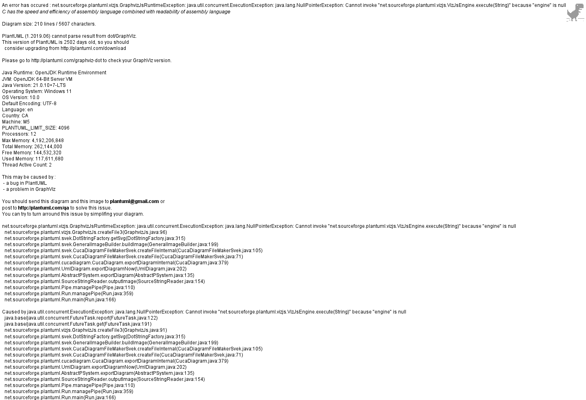
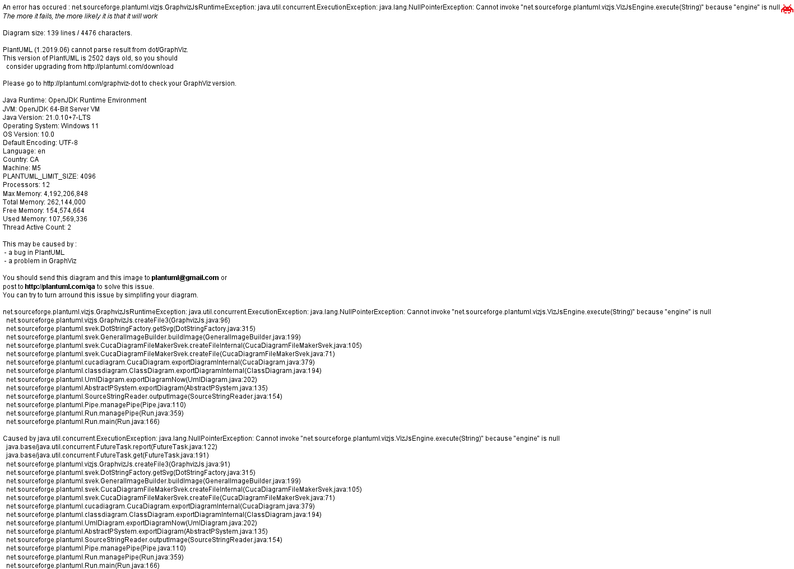
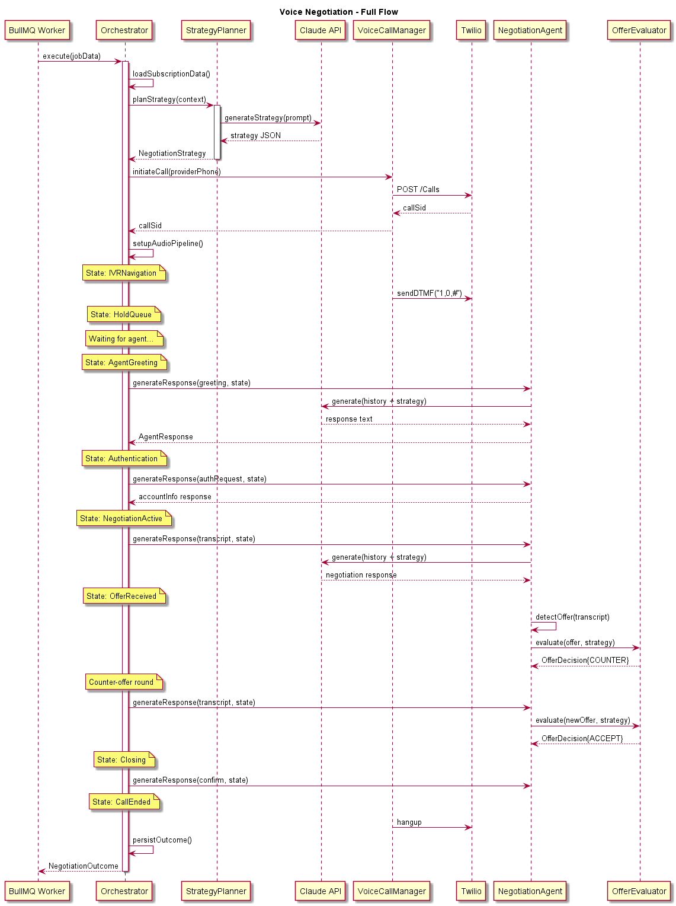
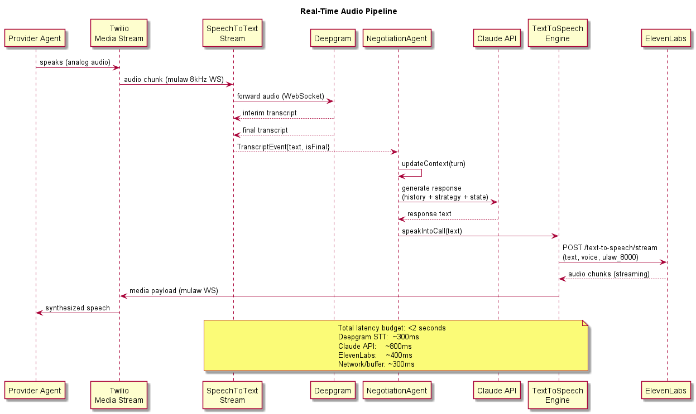
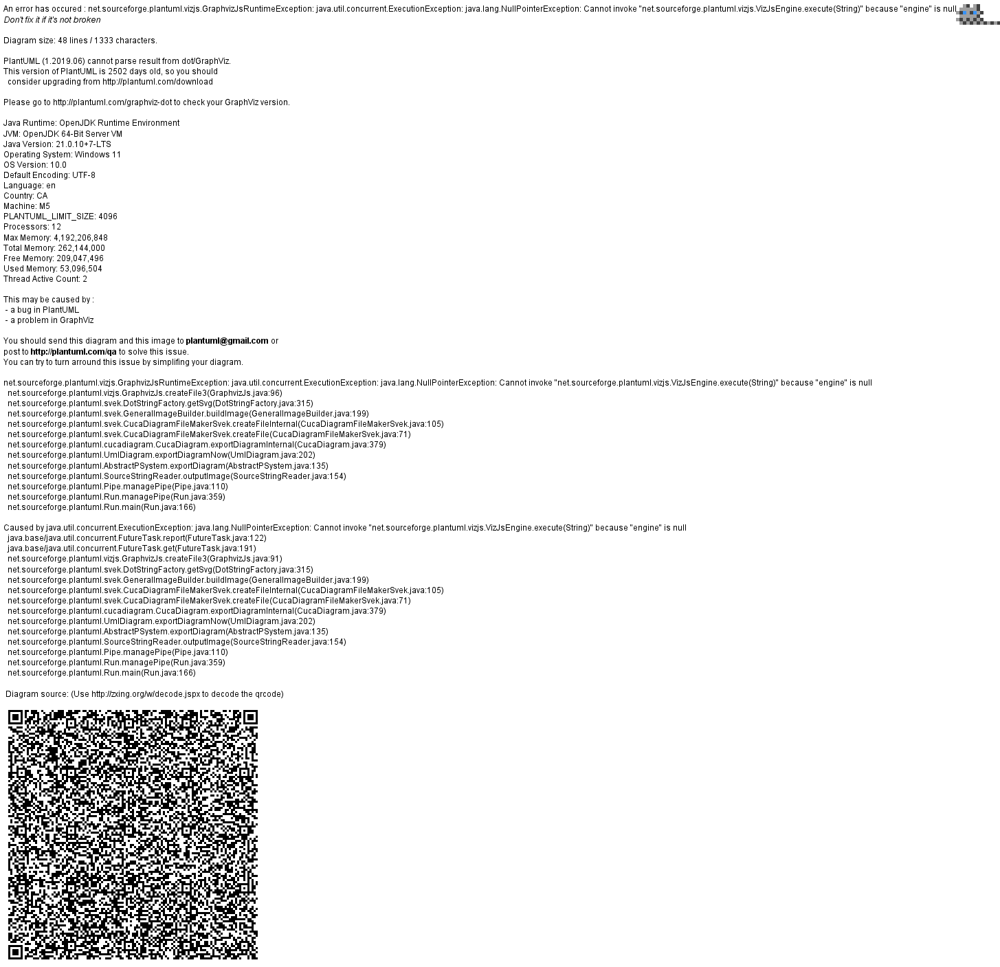
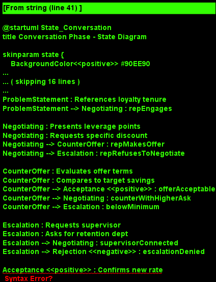

# Feature 04: AI Voice Negotiation Agent

## Overview

The AI Voice Negotiation Agent is the highest-value feature in BillKillAgent. It autonomously places outbound phone calls to service providers (cable, internet, insurance, utilities) and negotiates lower rates on behalf of the user. The system combines Claude API for real-time conversational reasoning, Twilio for telephony, Deepgram for speech-to-text transcription, and ElevenLabs for natural-sounding text-to-speech synthesis.

## Problem Statement

Bill negotiation is one of the most effective ways to reduce recurring costs, but most consumers avoid it due to the time, effort, and social discomfort involved. Hold times average 20-45 minutes, retention departments use trained scripts, and success requires persistence and knowledge of available promotions. An autonomous AI agent eliminates these friction points entirely.

## Core Capabilities

### Claude-Powered Negotiation Strategy

Before each call, the NegotiationStrategyPlanner uses Claude API to analyze the user's bill history, provider, current plan, market rates, and known retention offers to generate a tailored negotiation playbook. This includes:

- **Opening position**: target savings amount and fallback thresholds
- **Leverage points**: competitor pricing, loyalty tenure, usage patterns
- **Escalation triggers**: when to ask for a supervisor or retention department
- **Acceptance criteria**: minimum acceptable offer as a percentage of current bill
- **Conversation scripts**: key phrases and responses for common provider objections

### Twilio Outbound Calls

The VoiceCallManager handles the full Twilio call lifecycle:

1. Initiates outbound calls via Twilio Programmable Voice REST API
2. Configures media streams for bidirectional audio (Twilio Media Streams WebSocket)
3. Monitors call status via status callbacks (ringing, answered, completed, failed)
4. Handles DTMF tone generation for IVR navigation
5. Manages call duration limits and graceful termination

### Deepgram Real-Time Speech-to-Text

The SpeechToTextStream establishes a persistent WebSocket connection to Deepgram's streaming API. Inbound audio from Twilio's media stream (mulaw 8kHz) is forwarded in real-time to Deepgram, which returns interim and final transcription results. Key configuration:

- Model: `nova-2` for highest accuracy on phone audio
- Language: `en-US` with smart formatting enabled
- Endpointing: 500ms silence threshold for turn detection
- Interim results enabled for low-latency response triggering

### ElevenLabs Text-to-Speech

The TextToSpeechEngine converts Claude-generated responses into natural speech using ElevenLabs streaming API. Design considerations:

- Voice: pre-selected professional voice optimized for phone conversations
- Streaming: chunked audio delivery to minimize time-to-first-byte
- Format: mulaw 8kHz to match Twilio media stream requirements
- Stability/similarity settings tuned for consistent, confident tone

### Conversation State Machine

The ConversationStateMachine tracks the call through well-defined phases:

1. **Idle** -- awaiting job dispatch
2. **Dialing** -- Twilio call initiated, waiting for answer
3. **IVRNavigation** -- navigating automated phone menus via DTMF
4. **HoldQueue** -- waiting in provider hold queue
5. **AgentGreeting** -- human agent has answered
6. **Authentication** -- verifying account identity with provider
7. **NegotiationActive** -- actively negotiating rates
8. **OfferReceived** -- provider has made a retention offer
9. **OfferAccepted/OfferRejected** -- evaluating and responding to offer
10. **Closing** -- confirming changes, getting confirmation number
11. **CallEnded** -- call completed, logging outcome
12. **Failed** -- call failed due to error or provider hangup

### Retention Offer Handling

The RetentionOfferEvaluator uses the pre-planned strategy to evaluate offers in real-time:

- Parses offer details from transcribed conversation using Claude
- Compares offer against target savings and minimum acceptable threshold
- Decides accept, reject, or counter-offer based on strategy parameters
- Tracks multiple rounds of negotiation within a single call
- Escalates to retention department if initial agent cannot meet threshold

## Architecture

The negotiation system runs as a BullMQ worker job. When a negotiation action is approved (from the Action Queue), a job is enqueued with the subscription ID, provider details, and user preferences. The worker:

1. Loads bill data and generates strategy via Claude
2. Initiates Twilio call and opens media stream
3. Pipes audio bidirectionally: Twilio <-> Deepgram (STT) and ElevenLabs (TTS) <-> Twilio
4. Claude processes each transcribed utterance and generates responses
5. Responses are synthesized via ElevenLabs and streamed back to Twilio
6. The state machine governs transitions and triggers appropriate behaviors
7. On completion, the outcome (savings, new rate, confirmation number) is persisted

## Data Flow

```
User approves negotiation
  -> BullMQ job enqueued
  -> Worker picks up job
  -> Claude generates strategy
  -> Twilio places call
  -> Provider audio -> Twilio Media Stream -> Deepgram STT -> transcript
  -> Transcript -> Claude (with strategy context) -> response text
  -> Response text -> ElevenLabs TTS -> audio -> Twilio Media Stream -> provider hears AI
  -> Loop until negotiation concludes
  -> Outcome persisted to PostgreSQL
  -> User notified of result
```

## Key Design Decisions

| Decision | Rationale |
|----------|-----------|
| Deepgram over Whisper | Deepgram offers true real-time streaming with <300ms latency; Whisper requires batch processing |
| ElevenLabs over Twilio TTS | ElevenLabs produces significantly more natural speech, critical for convincing human agents |
| Claude for real-time reasoning | Claude's instruction-following and reasoning capabilities enable adaptive negotiation |
| State machine over free-form | Explicit states prevent the AI from getting lost in conversation and enable proper error recovery |
| BullMQ worker isolation | Each negotiation runs in its own job with retry/timeout semantics, preventing cascading failures |

## Non-Functional Requirements

- **Latency**: End-to-end response time (provider speaks -> AI responds) must be under 2 seconds
- **Reliability**: Failed calls automatically retry up to 3 times with exponential backoff
- **Concurrency**: System supports up to 10 simultaneous negotiation calls per worker instance
- **Transcript retention**: Full conversation transcripts retained for 90 days for audit and improvement
- **Cost control**: Per-call budget limit enforced (Twilio minutes + API costs) with automatic termination

## Security & Compliance

- User account credentials are never spoken; authentication uses account number and billing ZIP only
- All transcripts encrypted at rest (AES-256) in PostgreSQL
- Call recordings are NOT stored; only text transcripts are retained
- Users can review transcripts and must consent before first negotiation
- PII in transcripts is redacted after 30 days

## Diagrams

- 
- 
- 
- 
- 
- 
