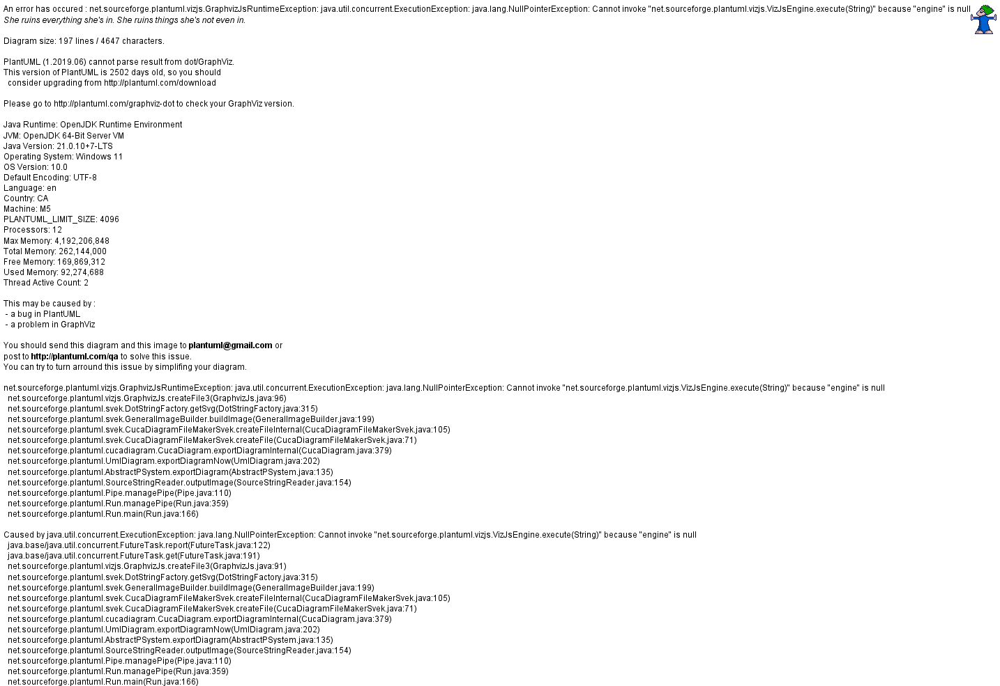
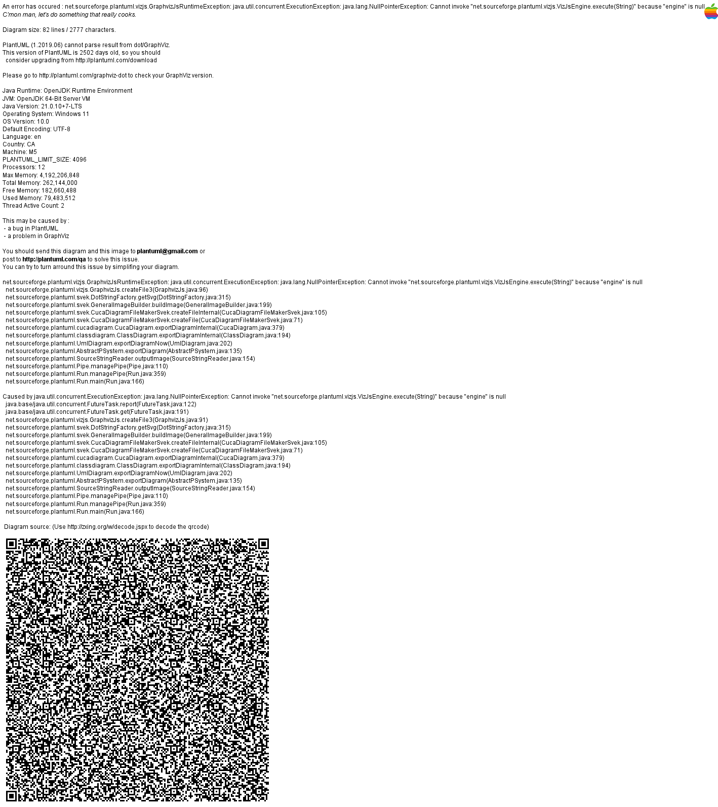
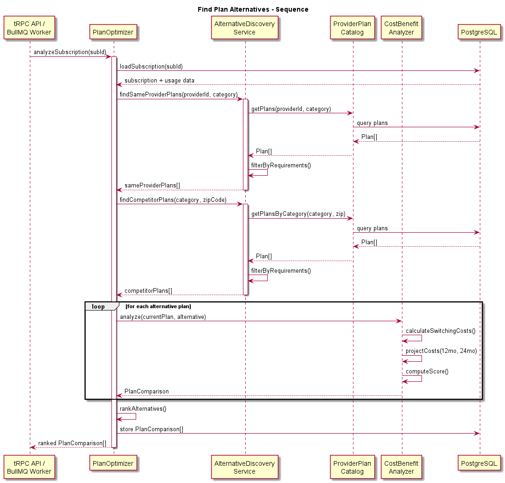
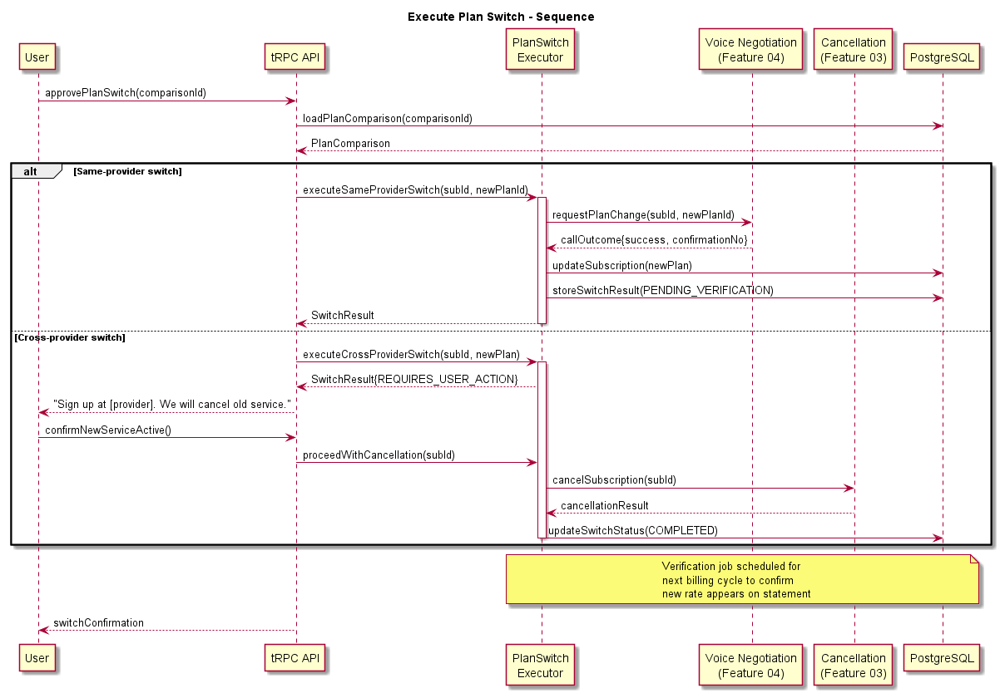

# Feature 05: Plan Optimization & Switching

## Overview

The Plan Optimization & Switching feature identifies opportunities to reduce costs by switching to better-suited plans with the same provider or migrating to a competing provider entirely. Unlike negotiation (Feature 04), which reduces the price of an existing plan, this feature analyzes whether the user is on the right plan given their actual usage patterns.

## Problem Statement

Consumers frequently remain on suboptimal plans long after their needs have changed. Common scenarios include:

- Paying for unlimited data when usage averages 3 GB/month
- Remaining on legacy plans that cost more than current offerings
- Missing bundle discounts by subscribing to services individually
- Overpaying for premium tiers when basic features are sufficient

This feature automates the discovery, comparison, and execution of plan switches.

## Core Capabilities

### Plan Comparison Engine

The PlanOptimizer serves as the entry point for optimization analysis. For each subscription, it:

1. Retrieves the user's current plan details and usage data from Feature 02 (Usage Analysis)
2. Queries the ProviderPlanCatalog for available plans from the same provider
3. Invokes AlternativeDiscoveryService to find competitor offerings
4. Runs CostBenefitAnalyzer to score each alternative
5. Produces ranked recommendations with projected savings

### Alternative Discovery

The AlternativeDiscoveryService maintains and queries a catalog of plans across providers within each service category (internet, mobile, streaming, insurance). Data sources include:

- **Provider APIs** where available (carrier plan endpoints)
- **Web scraping** of provider pricing pages via scheduled jobs
- **Manual catalog curation** for major providers
- **User-contributed data** (anonymized plan details from the user base)

Plans are normalized into a common schema for comparison: monthly cost, data/usage limits, contract terms, promotional period, included features.

### Cost-Benefit Analysis

The CostBenefitAnalyzer produces a comprehensive comparison that accounts for:

- **Direct cost savings**: monthly and annualized difference
- **Switching costs**: early termination fees, installation charges, equipment costs
- **Promotional pricing**: calculates true cost over 12/24 months including post-promo rate increases
- **Feature gaps**: what the user would lose by switching (channels, speed tiers, etc.)
- **Contract obligations**: remaining contract months and buyout costs
- **Net present value**: time-value calculation for upfront costs vs. ongoing savings

### Switch Execution

The PlanSwitchExecutor handles the logistics of actually switching plans:

- **Same-provider plan change**: Initiates via provider API, portal automation, or AI voice call (delegates to Feature 04)
- **Cross-provider migration**: Guides user through signup, coordinates service overlap period, and triggers cancellation of old service (delegates to Feature 03)
- **Verification**: Confirms the switch was executed correctly by monitoring subsequent billing

## Architecture

Plan optimization runs in two modes:

1. **Proactive scan** (scheduled): BullMQ cron job analyzes all active subscriptions weekly, produces recommendations surfaced in the dashboard
2. **On-demand analysis** (user-initiated): User requests optimization for a specific subscription; results returned synchronously via tRPC

Recommendations are stored in PostgreSQL with a status lifecycle: DISCOVERED -> PRESENTED -> APPROVED -> EXECUTING -> COMPLETED / FAILED / DISMISSED.

## Key Design Decisions

| Decision | Rationale |
|----------|-----------|
| Separate from negotiation | Plan switching is a fundamentally different action than price negotiation; different risk profile and execution path |
| Catalog-based comparison | Structured plan data enables deterministic comparison; LLM-only approach would be unreliable for pricing math |
| Conservative switch scoring | Switching costs and contract risks weighted heavily to avoid recommending changes that net-negative for the user |
| Hybrid execution | Some switches can be automated; others require user involvement (new account signup, credit check) |

## Non-Functional Requirements

- Plan catalog refreshed at minimum weekly per provider
- Comparison analysis completes in under 5 seconds for on-demand requests
- Recommendations include confidence score (0-100) based on data freshness and completeness
- All cost projections clearly labeled as estimates with assumptions stated

## Diagrams

- 
- 
- 
- 
