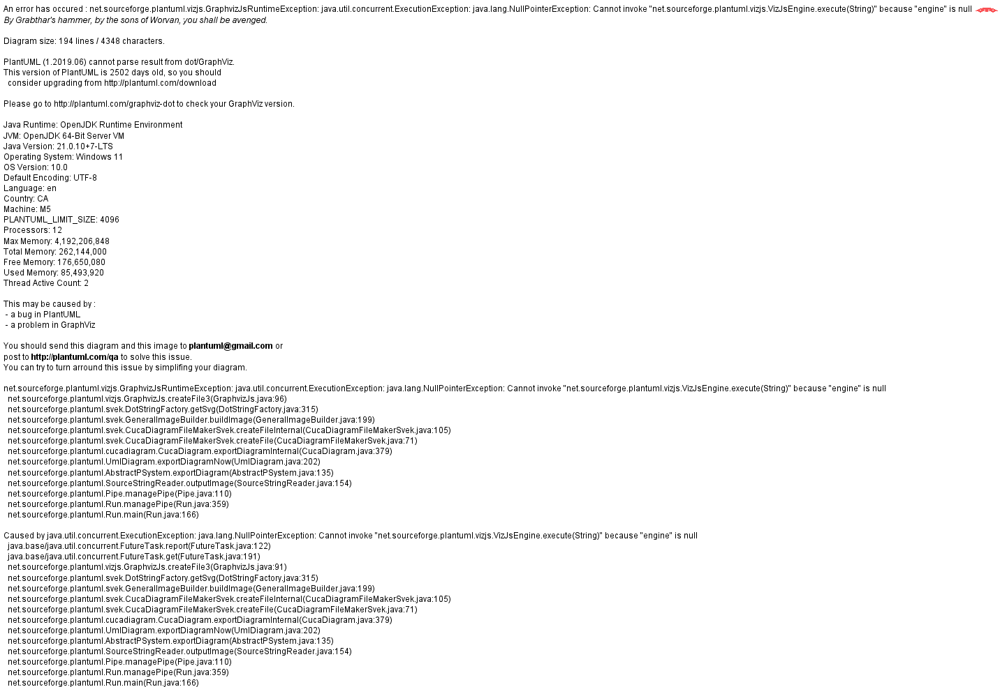
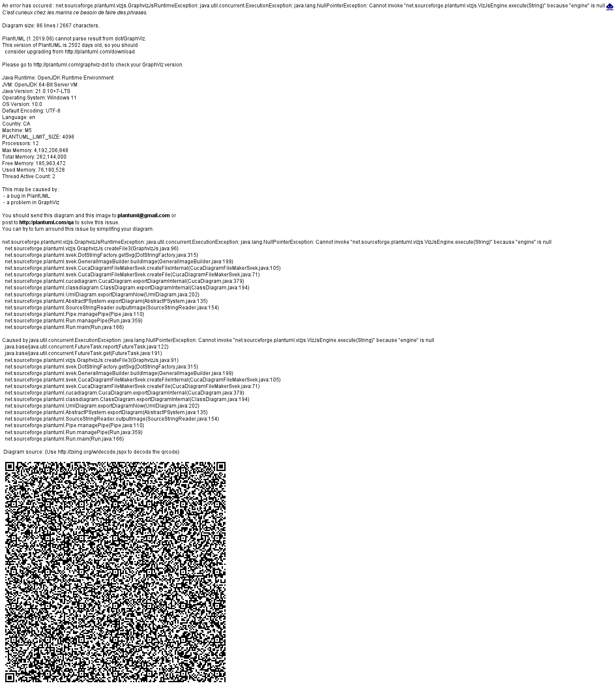
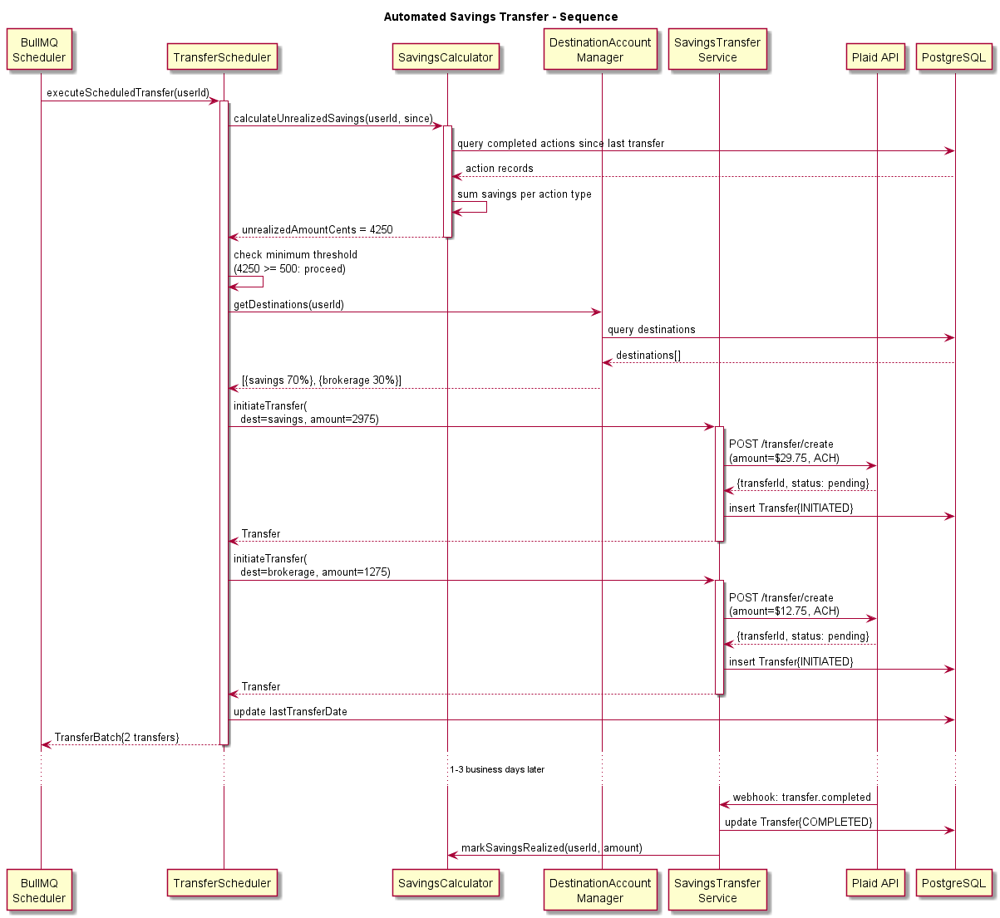
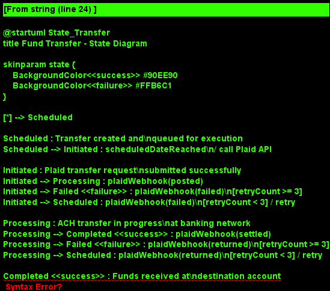

# Feature 06: Savings Reallocation

## Overview

The Savings Reallocation feature automatically calculates money saved through BillKillAgent actions (cancellations, negotiations, plan switches) and transfers those savings to a user-designated destination account -- a high-yield savings account, investment account, or debt payment. This closes the loop from "we saved you money" to "your money is working for you."

## Problem Statement

Even when consumers successfully reduce bills, the savings typically remain invisible -- absorbed into general spending rather than directed toward financial goals. By automatically calculating and transferring the exact savings amount, BillKillAgent transforms cost reduction into wealth building.

## Core Capabilities

### Savings Calculation

The SavingsCalculator determines exact savings from each completed action:

- **Cancellation savings**: Full monthly amount of the cancelled subscription, starting from the effective cancellation date
- **Negotiation savings**: Difference between old and new monthly rate, starting from the effective date
- **Plan switch savings**: Difference between old plan cost and new plan cost, accounting for any switching costs amortized over 12 months

Savings are calculated per billing cycle and aggregated monthly. The calculator handles edge cases: mid-cycle cancellations (prorated), promotional pricing expiration (adjusts projected savings), and reactivated subscriptions (stops counting savings).

### Destination Account Management

Users configure one or more destination accounts for their savings via the DestinationAccountManager:

- **Linked bank accounts** (via Plaid): savings or checking accounts at any Plaid-supported institution
- **Investment accounts**: brokerage accounts linked via Plaid for automated investment
- **Debt payments**: credit card or loan accounts for accelerated payoff
- **Split allocation**: percentage-based splitting across multiple destinations (e.g., 70% savings, 30% investment)

### Automated Transfers

The TransferScheduler and SavingsTransferService work together to move money:

1. At each scheduled interval (weekly, biweekly, or monthly), the scheduler triggers
2. SavingsCalculator computes cumulative unrealized savings since last transfer
3. If the amount exceeds the minimum threshold ($5 default), a transfer is initiated
4. Transfer executed via Plaid ACH transfer from the user's primary funding account to the destination
5. Transfer status tracked through completion or failure with automatic retry

### Investment Integration

For users who link investment accounts, savings can be automatically invested:

- Transfer to brokerage account via Plaid ACH
- Optional: trigger a buy order via brokerage API (future enhancement)
- Dashboard shows projected growth of invested savings over time

## Architecture

Savings reallocation operates as a combination of:

1. **Event-driven calculation**: When any action completes (cancellation, negotiation, switch), a savings record is created immediately
2. **Scheduled transfers**: BullMQ cron job runs at user-configured frequency to batch and execute transfers
3. **Transfer monitoring**: Separate job monitors pending transfers and updates status via Plaid webhooks

All financial calculations use integer cents (not floating point) to avoid rounding errors. Transfers use Plaid's ACH transfer API with proper idempotency keys.

## Key Design Decisions

| Decision | Rationale |
|----------|-----------|
| Plaid ACH for transfers | Plaid already integrated for bank feeds; ACH is low-cost and widely supported |
| Batch transfers over real-time | Reduces ACH transaction costs and avoids micro-transfers that annoy users |
| Minimum transfer threshold | Prevents uneconomical tiny transfers; configurable per user |
| Integer cents for money | Eliminates floating-point rounding errors in financial calculations |
| Conservative savings attribution | Only counts verified savings (confirmed new rate, confirmed cancellation) |

## Non-Functional Requirements

- Savings calculations accurate to the cent, verified against actual billing changes
- Transfer initiation within 1 business day of scheduled date
- Failed transfers retried up to 3 times over 5 business days
- Full audit trail of all calculations and transfers
- User can pause/resume auto-transfers at any time

## Security & Compliance

- Plaid access tokens stored encrypted (AES-256) in PostgreSQL
- Transfer amounts validated against calculated savings (cannot exceed)
- Daily transfer limit enforced ($10,000 default) as fraud prevention
- All transfer activity logged for regulatory compliance
- Users must re-authenticate to change destination accounts

## Diagrams

- 
- 
- 
- 
