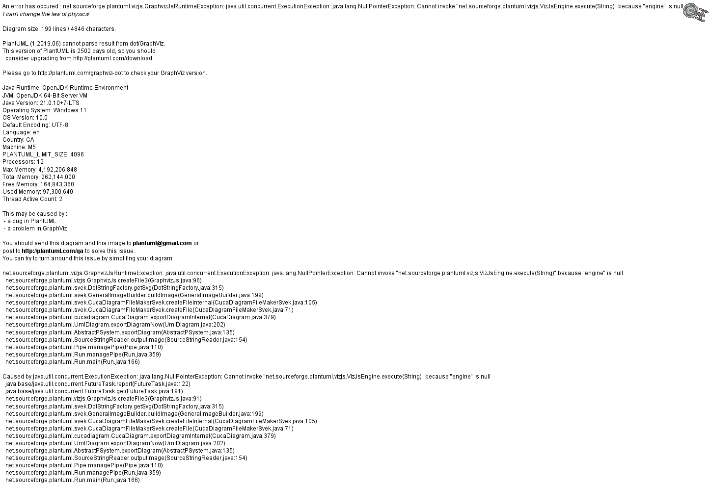
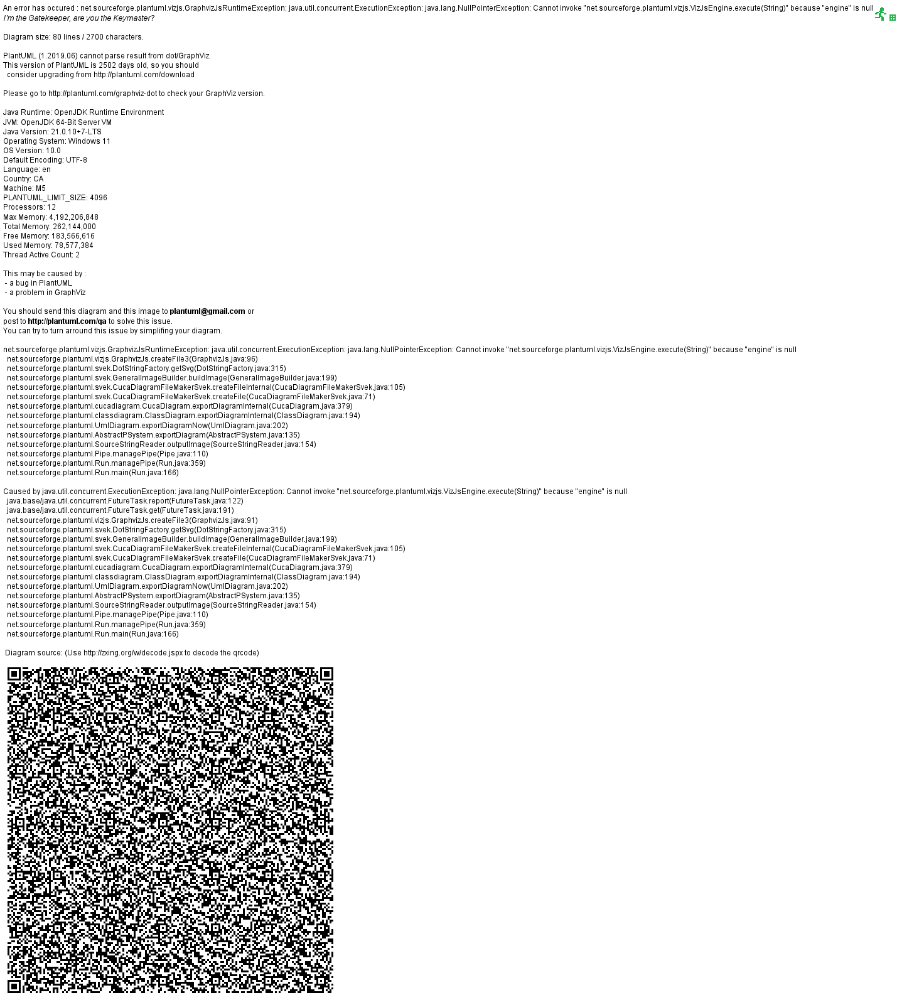
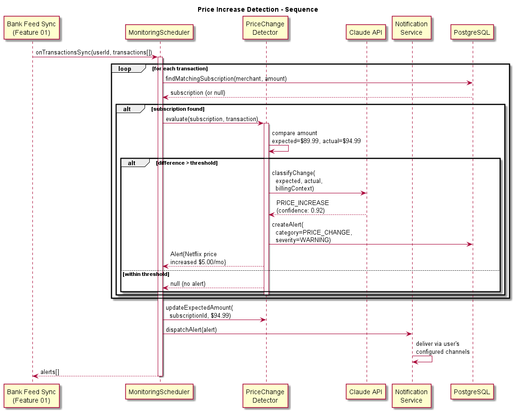
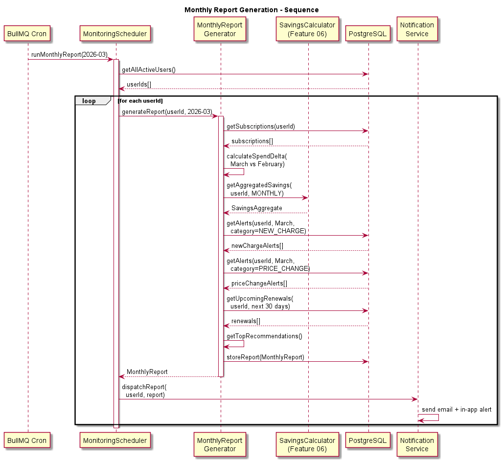
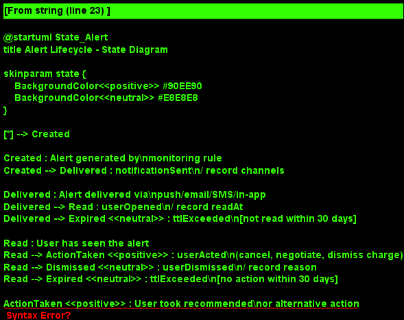

# Feature 07: Ongoing Monitoring & Alerts

## Overview

The Ongoing Monitoring & Alerts feature provides continuous surveillance of the user's subscriptions and bills after initial optimization. It detects price increases, new unexpected charges, approaching trial expirations, upcoming renewal dates, and generates monthly summary reports. This feature ensures that savings achieved by BillKillAgent are not eroded over time.

## Problem Statement

Cost optimization is not a one-time event. Providers regularly increase prices (often with minimal notice), free trials silently convert to paid subscriptions, annual renewals auto-charge at higher rates, and new recurring charges appear from forgotten signups. Without continuous monitoring, users gradually lose the savings they achieved.

## Core Capabilities

### Price Increase Detection

The PriceChangeDetector compares each billing transaction against the expected amount for that subscription. When a transaction exceeds the expected amount by a configurable threshold (default: $1 or 5%), an alert is generated. The detector:

- Maintains expected billing amounts per subscription (updated after negotiations/switches)
- Compares each new transaction against the expected amount
- Distinguishes genuine price increases from one-time charges or tax adjustments
- Uses Claude API to analyze provider communications (emails) for advance notice of increases
- Generates alerts with the old price, new price, increase amount, and recommended action

### New Charge Detection

The NewChargeDetector identifies recurring charges that were not previously tracked. It piggybacks on the transaction sync from Feature 01 (Bank Feed) and:

- Identifies new merchant patterns that match subscription billing (regular interval, consistent amount)
- Cross-references against the user's known subscription list
- Flags charges that appear without the user having explicitly subscribed (dark patterns, forgotten trials)
- Generates alerts prompting the user to categorize: keep, cancel, or investigate

### Trial Expiration Tracking

The TrialExpirationTracker monitors subscriptions that are in a free or discounted trial period:

- Tracks trial end dates from subscription metadata and transaction patterns
- Sends alerts at configurable intervals before expiration (7 days, 3 days, 1 day)
- Recommends action: cancel before trial ends, convert to paid, or negotiate a rate
- After trial expires, monitors for the first paid charge and alerts the user

### Renewal Date Tracking

The RenewalDateTracker monitors annual and semi-annual subscriptions approaching renewal:

- Predicts renewal dates based on historical transaction patterns
- Sends alerts 30, 14, and 7 days before anticipated renewal
- Includes the expected renewal amount and any detected price changes
- Suggests actions: renew, cancel, negotiate, or switch

### Monthly Reports

The MonthlyReportGenerator produces a comprehensive monthly summary:

- Total recurring spend this month vs. last month
- Savings achieved this month (from all action types)
- New charges detected
- Price changes detected
- Upcoming renewals and trial expirations
- Recommended actions for next month
- Cumulative lifetime savings

## Architecture

Monitoring operates on two triggers:

1. **Transaction-driven**: When new transactions are synced (Feature 01), they flow through the detection pipeline: PriceChangeDetector, NewChargeDetector, and pattern analysis
2. **Schedule-driven**: BullMQ cron jobs run daily for trial/renewal checks and monthly for report generation

Alerts are persisted to PostgreSQL and delivered through the Notification Service (Feature 10) via the user's configured channels (push, email, SMS, in-app).

### Monitoring Rule System

All detectors implement the `IMonitoringRule` interface, enabling a pluggable rule engine. Each rule:

- Evaluates transactions or subscription state
- Produces zero or more Alert entities
- Can be enabled/disabled per user
- Has configurable thresholds and notification preferences

## Key Design Decisions

| Decision | Rationale |
|----------|-----------|
| Rule-based architecture | Extensible pattern; new monitoring rules can be added without modifying the core pipeline |
| Transaction-driven + scheduled | Price changes detected immediately on sync; time-based events checked on schedule |
| Configurable thresholds | Users have different sensitivity levels; what matters to one user may not matter to another |
| Claude for increase analysis | Distinguishes genuine increases from one-time adjustments; improves alert accuracy |
| Alert lifecycle tracking | Prevents alert fatigue by tracking whether alerts were acted on or dismissed |

## Non-Functional Requirements

- Price increase detection within 1 hour of transaction sync
- Trial expiration alerts delivered reliably at configured advance intervals
- Monthly reports generated by the 2nd of each month for the prior month
- Alert delivery confirmed via notification service acknowledgment
- Maximum 5% false positive rate on price increase detection

## Alert Delivery Channels

Alerts are dispatched through the Notification Service (Feature 10):

- **In-app**: Notification center with unread badge
- **Push notification**: Mobile/browser push via web push API
- **Email**: Formatted HTML email with action buttons
- **SMS**: Twilio SMS for critical alerts (optional, user-configured)

Users configure alert preferences per category (price increases, trials, renewals, new charges) and per channel.

## Diagrams

- 
- 
- 
- 
- 
