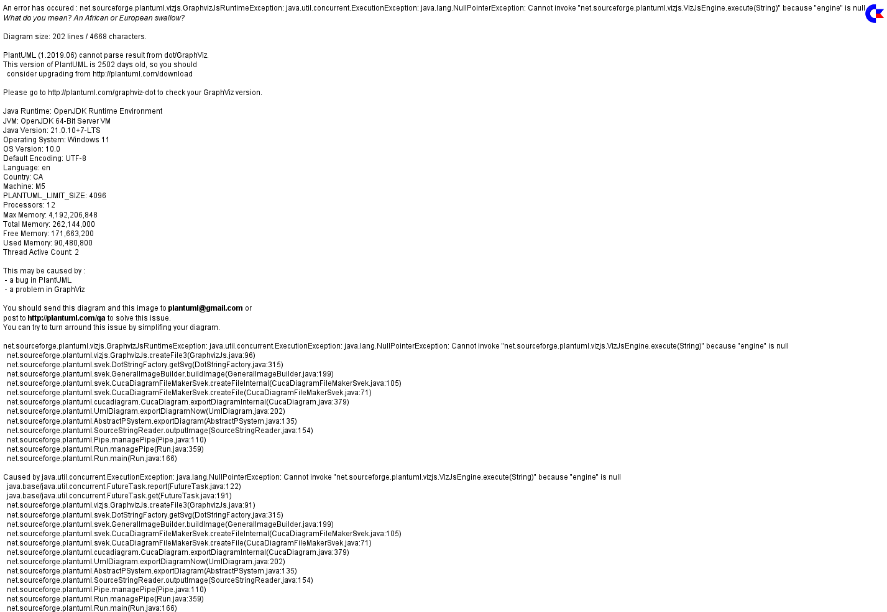
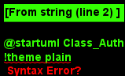
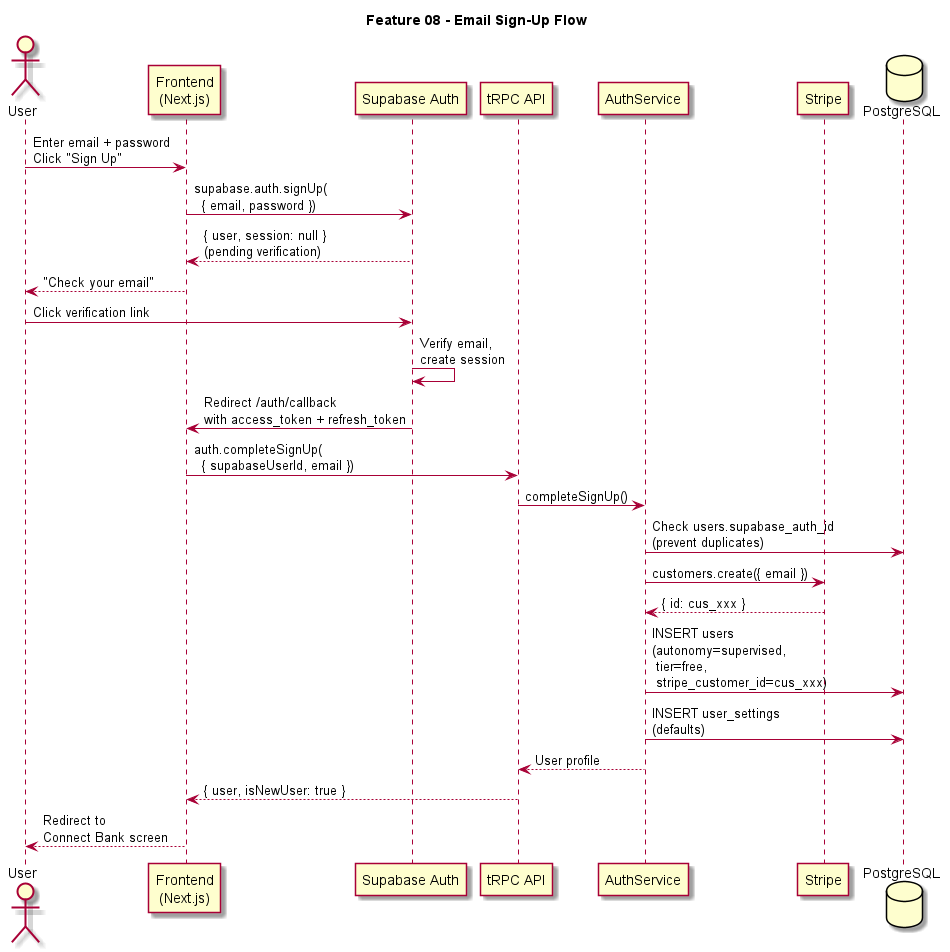
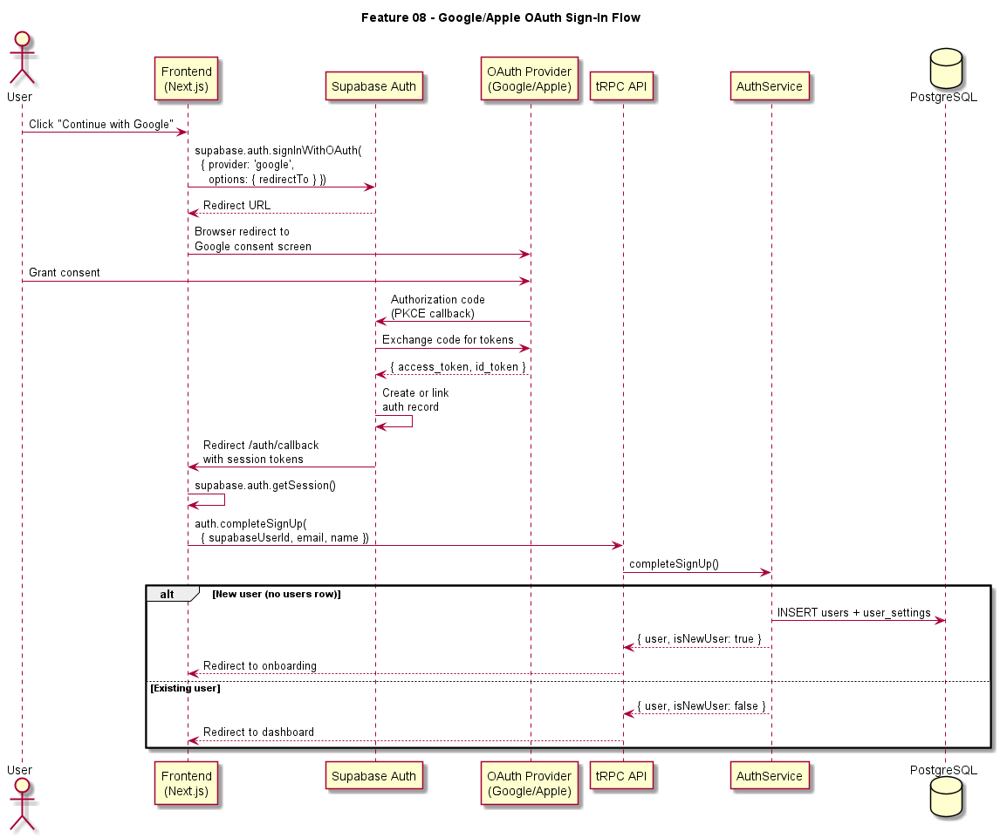
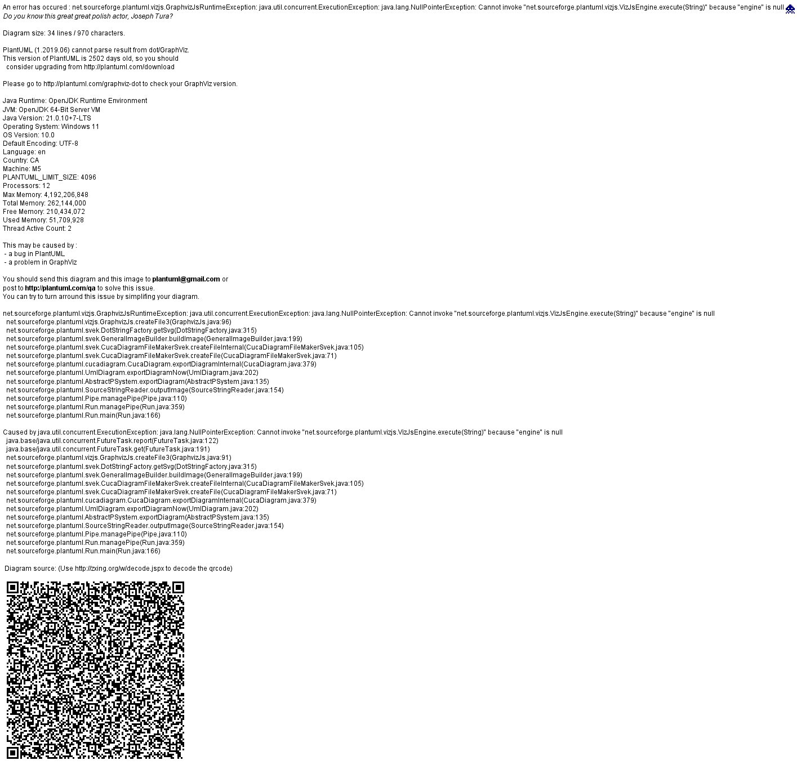

# Feature 08: User Management & Authentication

## Overview

User Management & Authentication is the foundational identity layer for BillKillAgent. It governs how users create accounts, authenticate, manage profiles, configure autonomy preferences, and subscribe to premium tiers. The system wraps Supabase Auth for identity and session management, Stripe for billing, and exposes all functionality through tRPC procedures protected by session middleware.

## Goals

- Provide frictionless sign-up via email/password, Google OAuth, and Apple OAuth
- Maintain secure, short-lived JWT sessions with automatic refresh
- Let users control their autonomy level (supervised, semi-autonomous, fully autonomous) and dollar thresholds
- Support two monetization tiers: free (performance-fee model) and premium ($9.99/month subscription)
- Comply with data-deletion requirements (GDPR/CCPA) through a complete account deletion flow

## Authentication Strategy

### Identity Provider: Supabase Auth

Supabase Auth handles credential storage, password hashing, email verification, OAuth provider integration, and JWT issuance. BillKillAgent never stores raw passwords. The Supabase project is configured with:

- **JWT expiry**: 15 minutes (access token), 7 days (refresh token)
- **Email confirmation**: Required before first sign-in
- **OAuth providers**: Google and Apple, configured in the Supabase dashboard with redirect URIs pointing to `{APP_URL}/auth/callback`
- **Row Level Security (RLS)**: Enabled on all user-facing tables. Policies reference `auth.uid()`.

### Session Flow

1. User authenticates via Supabase client SDK (browser-side).
2. Supabase returns an access token (JWT) and refresh token.
3. The access token is sent as a `Bearer` header on every tRPC request.
4. `SessionMiddleware` on the tRPC server validates the JWT against the Supabase JWKS endpoint, extracts `sub` (Supabase user ID), and loads the corresponding `users` row from PostgreSQL.
5. If the access token is expired but the refresh token is valid, the client SDK automatically refreshes and retries.

### Sign-Up Flow

| Step | Actor | Action |
|------|-------|--------|
| 1 | User | Clicks "Sign Up" on Welcome screen |
| 2 | Frontend | Calls `supabase.auth.signUp({ email, password })` or initiates OAuth |
| 3 | Supabase | Creates auth record, sends verification email (email/password only) |
| 4 | User | Clicks verification link / completes OAuth consent |
| 5 | Supabase | Redirects to `/auth/callback` with session tokens |
| 6 | Frontend | Calls `auth.completeSignUp` tRPC mutation |
| 7 | AuthService | Creates `users` row with defaults (autonomy: supervised, tier: free), creates Stripe customer |
| 8 | Frontend | Redirects to onboarding (Connect Bank screen) |

### OAuth Flows (Google / Apple)

OAuth follows the PKCE flow through Supabase:

1. Frontend calls `supabase.auth.signInWithOAuth({ provider: 'google' })`.
2. Browser redirects to Google/Apple consent screen.
3. On consent, provider redirects to Supabase callback URL.
4. Supabase exchanges the authorization code for tokens and creates/links the auth record.
5. Supabase redirects to `{APP_URL}/auth/callback` with session tokens.
6. If no `users` row exists for the `supabase_auth_id`, the `auth.completeSignUp` mutation creates one (same as step 7 above).

## Profile Management

User profiles live in the `users` table and include display name, avatar URL, autonomy settings, and billing tier. Avatars are uploaded to Supabase Storage (bucket: `avatars`, path: `{user_id}/{filename}`) and served via a signed URL with 1-hour expiry.

Profile updates are exposed via the `user.updateProfile` tRPC mutation and validated with Zod schemas.

## Autonomy Level Settings

BillKillAgent supports three autonomy levels that control how much agency the system has to act on the user's behalf:

| Level | Behavior |
|-------|----------|
| **Supervised** | All actions require explicit user approval before execution. Default for new users. |
| **Semi-Autonomous** | Actions below the user's configured dollar threshold execute automatically; actions above require approval. |
| **Fully Autonomous** | All detected savings opportunities are executed immediately without approval. |

The autonomy level and dollar threshold are stored on the `users` row (`autonomy_level` enum, `savings_threshold` numeric). Changes are applied immediately and affect all future action evaluations. The action execution pipeline checks these settings before auto-executing.

## Premium Tiers

### Free Tier
- Full access to subscription discovery, waste detection, and action queue
- BillKillAgent takes a **25% performance fee** on realized savings (first 12 months of each saving)
- Limited to 1 connected bank account

### Premium Tier ($9.99/month)
- No performance fees
- Unlimited connected bank accounts
- Priority negotiation queue
- Monthly savings report card
- Managed via Stripe Checkout and Stripe Customer Portal

### Stripe Integration

- On sign-up, a Stripe customer is created (`stripe.customers.create`) and the `stripe_customer_id` is stored on the `users` row.
- Upgrading opens a Stripe Checkout Session in `subscription` mode with the premium price ID.
- Webhook events (`customer.subscription.created`, `customer.subscription.updated`, `customer.subscription.deleted`, `invoice.payment_failed`) update the `plan_tier` column and create `billing_events` records.
- Downgrade/cancellation uses the Stripe Customer Portal (self-service).

## Account Deletion

Account deletion follows a soft-delete-then-purge pattern:

1. User confirms deletion in Settings with password re-entry.
2. `user.deleteAccount` tRPC mutation marks the `users` row as `status = 'deleted'` and `deleted_at = now()`.
3. Supabase Auth account is disabled via admin API.
4. Active Stripe subscriptions are cancelled immediately.
5. Plaid items are removed (access tokens revoked).
6. A BullMQ job (`user.purge`) is scheduled for 30 days later to hard-delete all user data.
7. If the user logs in within 30 days, they can reactivate (status reset, Supabase re-enabled).

## Security Considerations

- All tRPC mutations that modify user data require authenticated sessions (enforced by `SessionMiddleware`).
- Rate limiting: 5 sign-up attempts per IP per hour, 10 login attempts per account per 15 minutes (Redis counters).
- Refresh tokens are stored in `httpOnly` cookies; access tokens in memory only.
- CSRF protection via `SameSite=Lax` cookies and origin checking.
- Admin operations (disable account, purge data) use the Supabase service-role key, which is only available server-side.

## Environment Variables

| Variable | Purpose |
|----------|---------|
| `NEXT_PUBLIC_SUPABASE_URL` | Supabase project URL |
| `NEXT_PUBLIC_SUPABASE_ANON_KEY` | Supabase anonymous/public key |
| `SUPABASE_SERVICE_ROLE_KEY` | Server-side admin operations |
| `STRIPE_SECRET_KEY` | Stripe API access |
| `STRIPE_WEBHOOK_SECRET` | Stripe webhook signature verification |
| `STRIPE_PREMIUM_PRICE_ID` | Stripe price ID for premium tier |

## Diagrams

