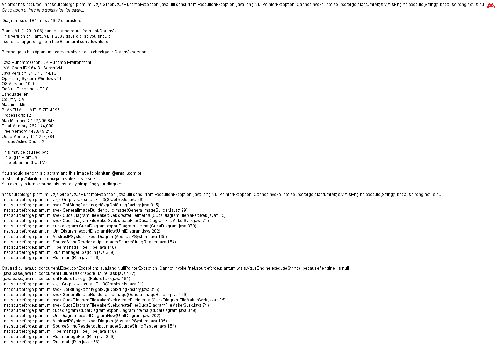
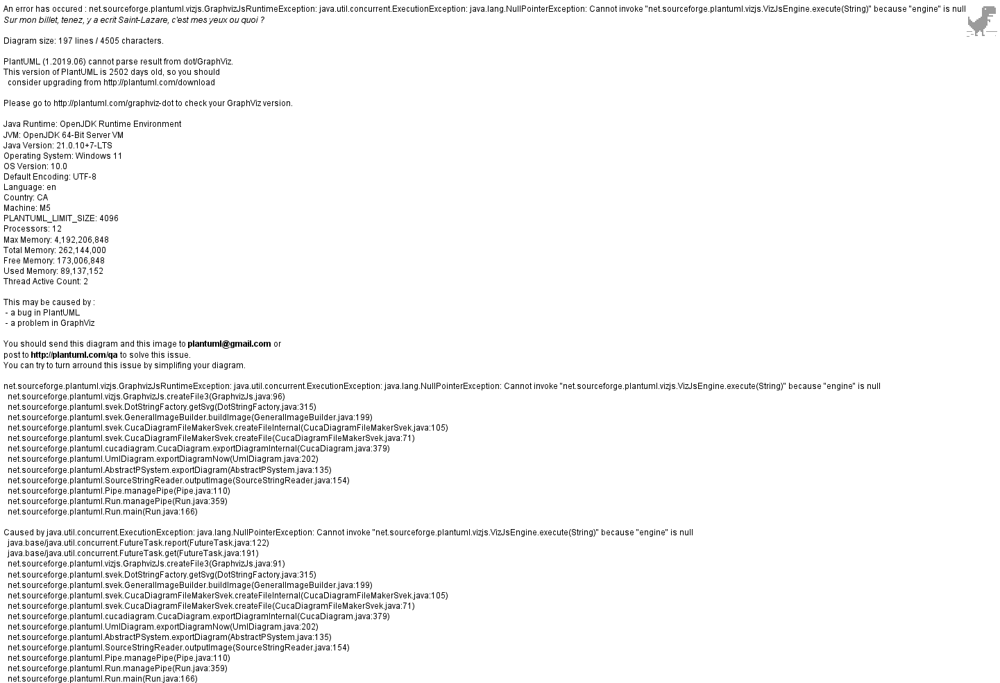
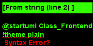
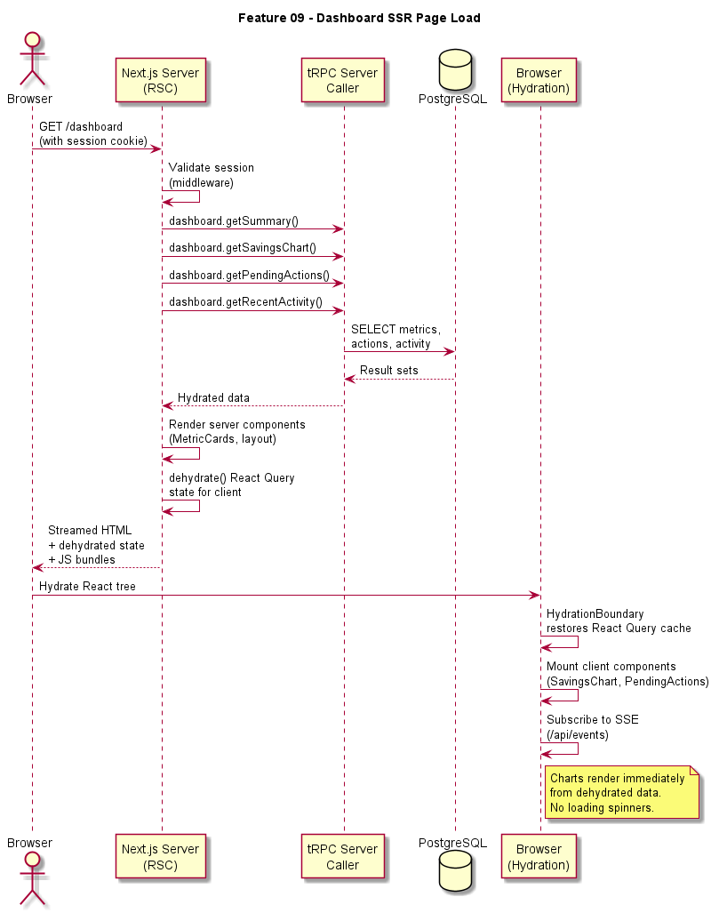
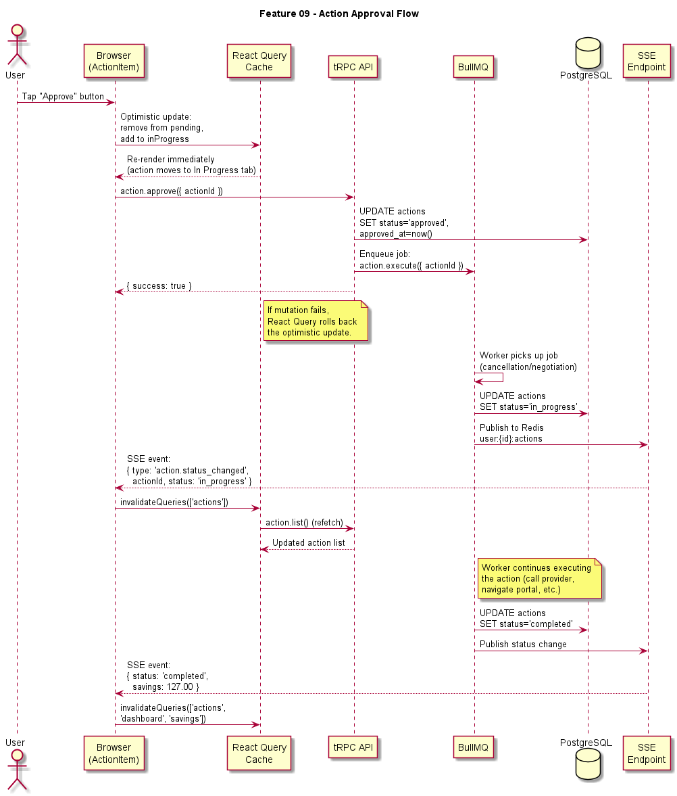
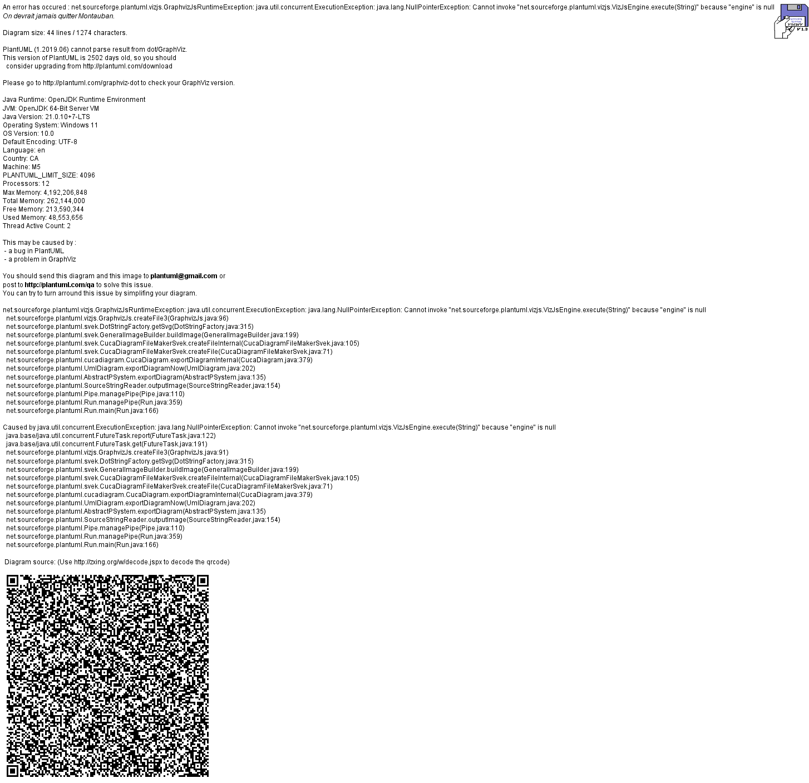

# Feature 09: Frontend Web App

## Overview

The BillKillAgent frontend is a Next.js 15 application using the App Router, server components, and streaming SSR. It provides the complete user interface for account onboarding, subscription management, action approval, savings tracking, and settings configuration. The app is designed mobile-first and supports breakpoints from 320px to 1440px+.

## Technology Stack

| Layer | Technology | Purpose |
|-------|-----------|---------|
| Framework | Next.js 15 (App Router) | SSR, routing, API routes, middleware |
| Styling | Tailwind CSS v4 | Utility-first CSS with dark theme |
| Components | Shadcn/ui | Accessible primitive components (Dialog, Dropdown, Tabs, etc.) |
| Data Fetching | tRPC + React Query | Type-safe API calls with caching and optimistic updates |
| Charts | Recharts | SVG-based data visualization (area charts, donut charts) |
| Auth | Supabase Client SDK | Browser-side authentication and session management |
| Real-Time | Server-Sent Events (SSE) | Live action status updates and notifications |
| State | React Query + Zustand | Server state (React Query) + ephemeral client state (Zustand) |
| Fonts | Instrument Serif, DM Mono, Inter | Headings, numbers, body text |

## Design System

### Theme

The app uses a dark theme throughout:

| Token | Value | Usage |
|-------|-------|-------|
| `--bg-primary` | `#0A0A0B` | Page background |
| `--bg-card` | `#141417` | Card surfaces |
| `--bg-elevated` | `#1C1C21` | Elevated elements (modals, dropdowns) |
| `--accent` | `#FF5C00` | Primary accent (CTAs, active states, charts) |
| `--accent-hover` | `#E65500` | Accent hover state |
| `--text-primary` | `#FFFFFF` | Primary text |
| `--text-secondary` | `#8A8A8E` | Secondary/muted text |
| `--text-tertiary` | `#555558` | Tertiary text (timestamps, labels) |
| `--success` | `#00C48C` | Success states, positive savings |
| `--warning` | `#FFB800` | Warning states |
| `--error` | `#FF3B3B` | Error states, critical alerts |
| `--border` | `#2A2A2F` | Card and divider borders |

### Typography

| Role | Font | Weight | Sizes |
|------|------|--------|-------|
| Headings (h1-h3) | Instrument Serif | 400 | 32px, 24px, 20px |
| Numbers / Metrics | DM Mono | 500 | 36px, 24px, 16px |
| Body / Labels | Inter | 400, 500, 600 | 16px, 14px, 12px |

### Breakpoints

| Name | Range | Layout |
|------|-------|--------|
| xs | 320-479px | Single column, bottom tab bar |
| sm | 480-767px | Single column, wider cards |
| md | 768-1023px | Two columns, bottom or side nav |
| lg | 1024-1439px | Sidebar nav, multi-column |
| xl | 1440px+ | Max-width 1400px container, spacious layout |

## Application Architecture

### Directory Structure

```
apps/web/
  app/
    (auth)/
      login/page.tsx
      signup/page.tsx
      callback/route.ts        # Supabase OAuth callback
    (onboarding)/
      layout.tsx               # Onboarding shell (no sidebar)
      connect-bank/page.tsx
      scanning/page.tsx
      discovery/page.tsx
      approve/page.tsx
    (app)/
      layout.tsx               # AppShell with sidebar/tabbar
      dashboard/page.tsx
      subscriptions/page.tsx
      actions/page.tsx
      negotiations/page.tsx
      savings/page.tsx
      settings/page.tsx
      notifications/page.tsx
    layout.tsx                 # Root layout (fonts, theme, providers)
    globals.css
  components/
    layout/
      AppShell.tsx
      Sidebar.tsx
      TabBar.tsx
      TopHeader.tsx
    dashboard/
      MetricCard.tsx
      SavingsChart.tsx
      PendingActions.tsx
      ActivityFeed.tsx
    subscriptions/
      FilterBar.tsx
      SubscriptionTable.tsx
      SubscriptionRow.tsx
      SubscriptionDetail.tsx
    actions/
      TabGroup.tsx
      ActionItem.tsx
    negotiations/
      StatsCards.tsx
      NegotiationRow.tsx
      NegotiationDetail.tsx
    savings/
      SavingsOverview.tsx
      SavingsChart.tsx
      CategoryBreakdown.tsx
      TransferHistory.tsx
    settings/
      ConnectedAccounts.tsx
      AutonomySelector.tsx
      NotificationToggles.tsx
      SavingsDestination.tsx
      ProfileSection.tsx
    onboarding/
      OnboardingProgress.tsx
    notifications/
      AlertBanner.tsx
      NotificationItem.tsx
      MonthlyReportCard.tsx
    ui/                        # Shadcn/ui primitives
  hooks/
    useAuth.ts
    useSubscriptions.ts
    useActionQueue.ts
    useSavingsData.ts
    useNotifications.ts
  lib/
    trpc.ts                    # tRPC client setup
    supabase.ts                # Supabase browser client
    utils.ts                   # cn(), formatCurrency(), etc.
```

### Rendering Strategy

- **Server Components (default)**: Layout shells, static content, initial data fetching via tRPC server caller.
- **Client Components (`"use client"`)**: Interactive widgets (charts, forms, action buttons), components using hooks or browser APIs.
- **Streaming SSR**: Dashboard and list pages use `Suspense` boundaries to stream above-the-fold content first, then hydrate below-the-fold widgets.

### Data Fetching

tRPC is configured with React Query for client-side data management:

- **SSR Prefetch**: Server components call tRPC procedures directly (server caller) and pass hydrated data to client components via `dehydrate/HydrationBoundary`.
- **Client Queries**: Client components use `trpc.useQuery()` for data with automatic background refetching.
- **Mutations**: `trpc.useMutation()` with optimistic updates for approve/dismiss actions.
- **Real-Time**: SSE endpoint (`/api/events`) pushes action status changes and new notifications. Client subscribes via `EventSource` and invalidates relevant React Query caches.

### tRPC Client Setup

```typescript
// apps/web/lib/trpc.ts
import { createTRPCReact } from '@trpc/react-query';
import type { AppRouter } from '@billkill/api';

export const trpc = createTRPCReact<AppRouter>();
```

The tRPC client is configured with:
- `httpBatchLink` pointing to `/api/trpc`
- Authorization header from Supabase session
- Automatic retry (3 attempts with exponential backoff) on network errors
- Request deduplication within 10ms window

### Authentication Integration

The root layout initializes the Supabase client and listens for `onAuthStateChange`. The `useAuth` hook provides:
- `user`: Current Supabase user (or null)
- `session`: Current session with tokens
- `signOut()`: Signs out and redirects to login
- `isLoading`: True while checking initial session

Next.js middleware (`middleware.ts`) checks the Supabase session cookie on protected routes and redirects unauthenticated users to `/login`.

## Responsive Layout System

### Desktop (1024px+): Sidebar Layout

The `AppShell` renders a fixed-width sidebar (240px collapsed to 64px) on the left with the content area filling the remaining width. The sidebar contains:
- App logo
- Navigation links with icons and labels
- Active state indicator (orange left border + background)
- User avatar at bottom
- Notification bell with badge

### Tablet (768-1023px): Condensed Sidebar

The sidebar collapses to icon-only (64px) by default. Hovering expands it temporarily with an overlay.

### Mobile (<768px): Bottom Tab Bar

The sidebar is hidden. A fixed bottom tab bar shows 5 tabs: Dashboard, Subscriptions, Actions, Savings, Settings. The top header shows the page title and notification bell.

## Real-Time Updates

Action status changes (pending -> in_progress -> completed) are delivered via SSE:

1. Worker completes an action step and publishes to Redis pub/sub channel `user:{userId}:actions`.
2. The SSE endpoint (`/api/events`) subscribes to the user's Redis channel.
3. Events are pushed to the browser as `EventSource` messages.
4. The `useActionQueue` hook listens for these events and calls `queryClient.invalidateQueries()` to refresh relevant data.

This ensures users see live progress without polling.

## Performance Targets

| Metric | Target |
|--------|--------|
| Lighthouse Performance | > 90 |
| First Contentful Paint | < 1.2s |
| Largest Contentful Paint | < 2.5s |
| Cumulative Layout Shift | < 0.1 |
| Time to Interactive | < 3.0s |
| Bundle size (initial JS) | < 150 KB (gzipped) |

Achieved through: server components by default, dynamic imports for charts and modals, image optimization via `next/image`, font subsetting.

## Diagrams







