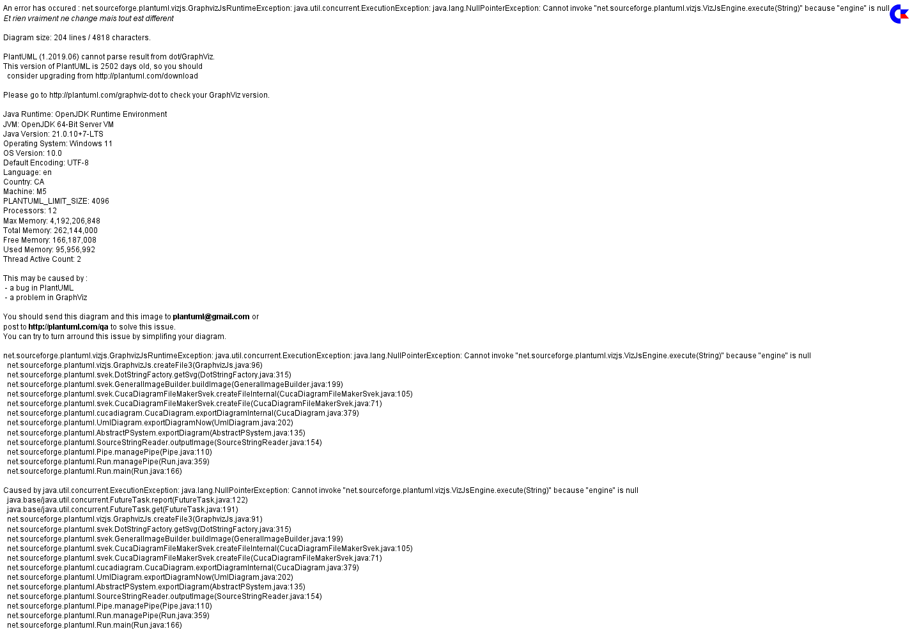
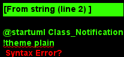
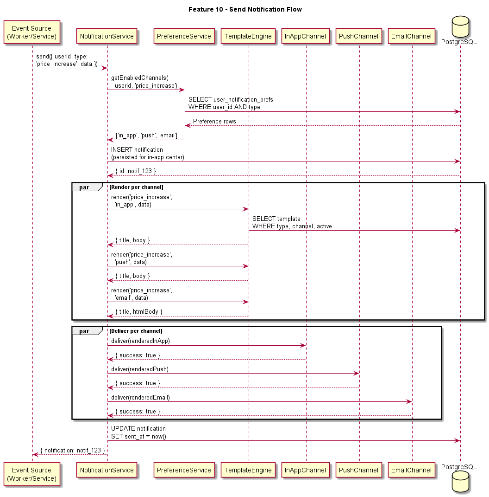
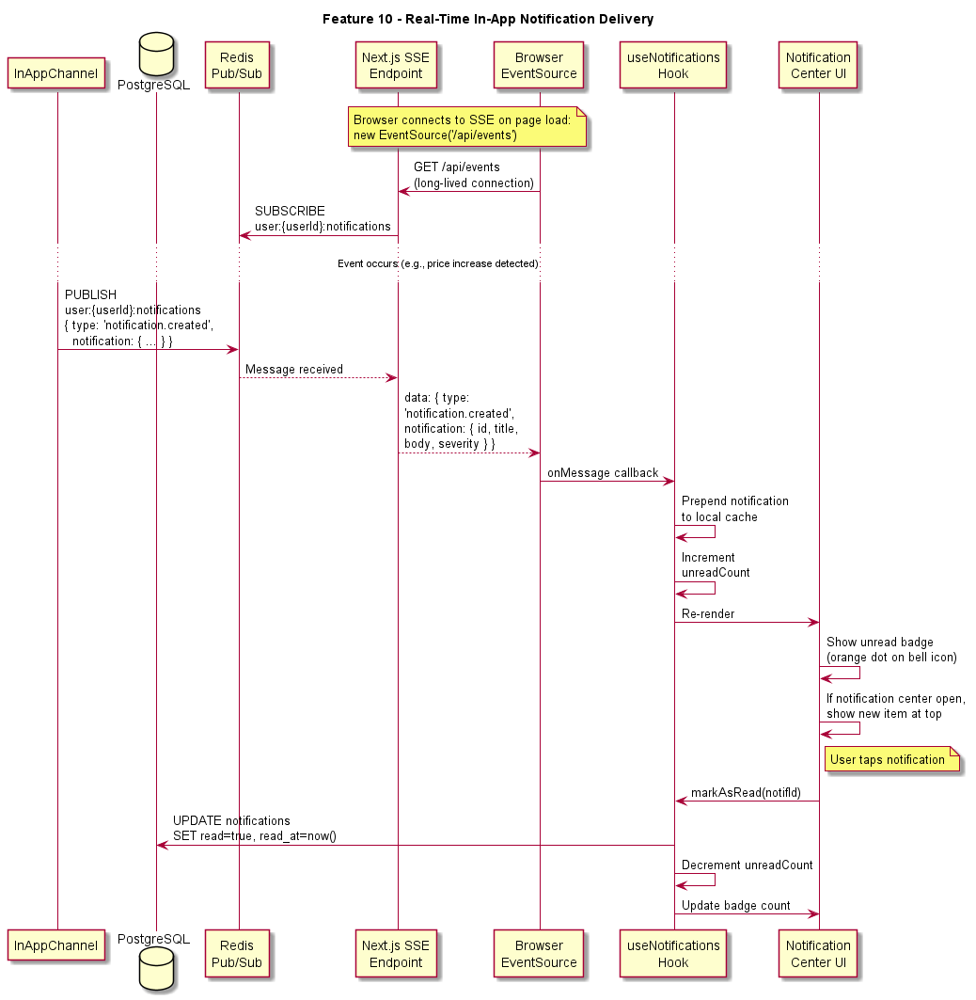
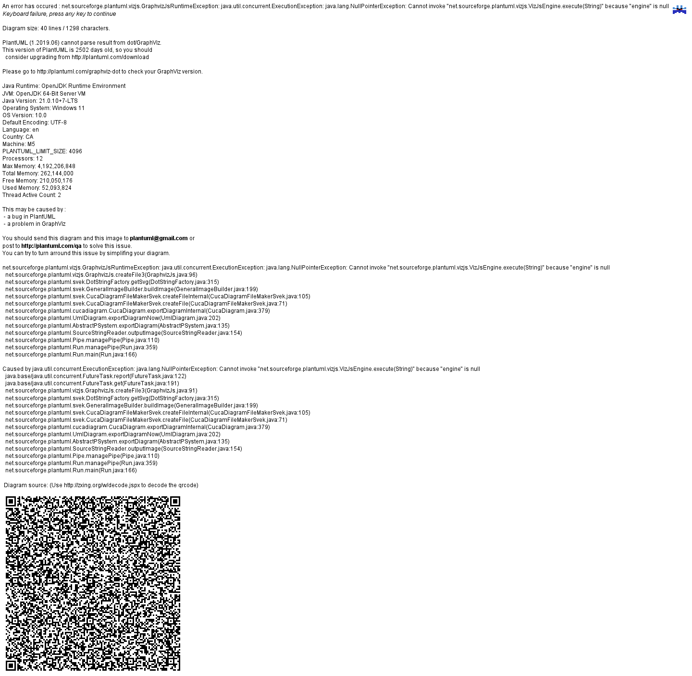

# Feature 10: Notification Service

## Overview

The Notification Service is BillKillAgent's multi-channel communication layer. It delivers timely, actionable notifications to users about subscription changes, negotiation outcomes, savings milestones, and system events. The service supports four delivery channels (in-app, push, email, SMS), respects per-user preferences, and uses a template engine to render consistent, branded messages.

## Goals

- Deliver notifications within 5 seconds of the triggering event for in-app and push channels
- Respect user preferences: never send on a disabled channel or for a disabled event type
- Provide a unified template system so notification content is consistent across all channels
- Support the notification center UI (read/unread state, action URLs, dismissal)
- Deliver monthly savings report cards as a special notification type

## Architecture

The notification pipeline follows a fan-out pattern:

1. **Event Source**: A service or worker emits a notification event (e.g., `negotiation.completed`, `price.increase.detected`).
2. **NotificationService** (central dispatcher): Receives the event, resolves the target user, and orchestrates delivery.
3. **NotificationPreferenceService**: Checks the user's per-channel and per-event-type preferences. Returns the list of enabled channels.
4. **NotificationTemplateEngine**: Renders the notification title and body from a template + data context for each channel (in-app may differ from email).
5. **Channel Dispatchers**: Each enabled channel receives the rendered notification and delivers it through its transport.

All notifications are persisted to the `notifications` table regardless of delivery channel, ensuring the in-app notification center always has the full history.

## Notification Types

| Type | Trigger | Severity | Default Channels |
|------|---------|----------|------------------|
| `price_increase` | Price increase detected on a subscription | warning | in-app, push, email |
| `trial_expiring` | Free trial ending within 3 days | warning | in-app, push |
| `renewal_upcoming` | Annual subscription renewing within 7 days | info | in-app, email |
| `negotiation_started` | AI negotiation call initiated | info | in-app |
| `negotiation_completed` | Negotiation finished with outcome | info | in-app, push, email |
| `cancellation_completed` | Subscription successfully cancelled | info | in-app, push |
| `action_requires_approval` | New action pending user approval | info | in-app, push |
| `savings_milestone` | User hits a savings milestone ($100, $500, $1000, etc.) | info | in-app, push, email |
| `payment_failed` | Platform subscription payment failed | critical | in-app, push, email, sms |
| `monthly_report` | Monthly savings report card generated | info | in-app, email |
| `new_charge_detected` | New recurring charge found | info | in-app |
| `account_security` | Password changed, new login detected | critical | in-app, email |

## Delivery Channels

### In-App

All notifications are persisted to the `notifications` table and delivered in real-time via Server-Sent Events (SSE). The frontend notification center reads from this table and displays unread badges. This channel cannot be disabled.

### Push (Web Push API)

Push notifications are sent via the Web Push API using VAPID keys. Users must grant browser permission. Push subscriptions are stored in a `push_subscriptions` table (endpoint, p256dh key, auth key). Notifications are sent using the `web-push` npm package.

### Email

Transactional emails are sent via [Resend](https://resend.com). Each notification type has an HTML email template (React Email components). Emails include unsubscribe links that map to the user's notification preferences. Rate-limited to prevent spam: max 10 emails per user per day.

### SMS

SMS messages are sent via Twilio. Used only for critical notifications (payment failures, security alerts). Phone numbers are collected during onboarding (optional) or settings. Rate-limited to 5 SMS per user per day.

## Template System

Templates are stored in the `notification_templates` table and support Handlebars-style variable interpolation:

```
Title: "Price increase on {{provider_name}}"
Body: "{{provider_name}} is increasing from {{old_price}} to {{new_price}} per month, effective {{effective_date}}. Want us to negotiate?"
```

Each template has variants for different channels:
- **in_app**: Short title + body (plain text, max 200 chars body)
- **push**: Title + short body (max 100 chars)
- **email**: Full HTML template with branding, images, and CTA buttons
- **sms**: Plain text, max 160 chars

Templates are versioned. The system always uses the latest active version.

## Alert Banners

Alert banners are a special presentation layer on top of notifications. When a notification has `display_as_banner = true`, the frontend renders it as a full-width banner at the top of the relevant page (e.g., a price increase banner on the Subscriptions page). Banners are:

- Color-coded by severity: blue (info), amber (warning), red (critical)
- Dismissible (stores dismissed state per notification ID in the `notifications.dismissed_at` column)
- Actionable (optional CTA button linking to the relevant action/page)

## Monthly Report Card

The monthly report is a special notification generated on the 1st of each month by a scheduled BullMQ job (`notification.monthly-report`):

1. Worker aggregates the user's monthly data: total saved, actions taken, new charges detected, top recommendation.
2. Worker calls `NotificationService.send()` with type `monthly_report` and the report data.
3. The in-app channel persists a rich notification with a link to the full report card view.
4. The email channel sends a branded HTML email with the report summary.
5. The frontend `MonthlyReportCard` component renders the full report with a "Share" button.

## Error Handling

- **Channel failures**: If a channel fails to deliver (e.g., Twilio API error), the failure is logged but does not block other channels. Failed deliveries are retried up to 3 times with exponential backoff via BullMQ.
- **Invalid push subscriptions**: If a push delivery returns a 410 (Gone) status, the subscription is deleted from `push_subscriptions`.
- **Template rendering errors**: If a template variable is missing, the template engine falls back to a generic message and logs a warning.

## Environment Variables

| Variable | Purpose |
|----------|---------|
| `RESEND_API_KEY` | Resend email delivery |
| `TWILIO_ACCOUNT_SID` | Twilio SMS |
| `TWILIO_AUTH_TOKEN` | Twilio SMS |
| `TWILIO_PHONE_NUMBER` | Sender phone number for SMS |
| `VAPID_PUBLIC_KEY` | Web Push VAPID public key |
| `VAPID_PRIVATE_KEY` | Web Push VAPID private key |
| `VAPID_SUBJECT` | Web Push VAPID subject (mailto: URL) |

## Diagrams






